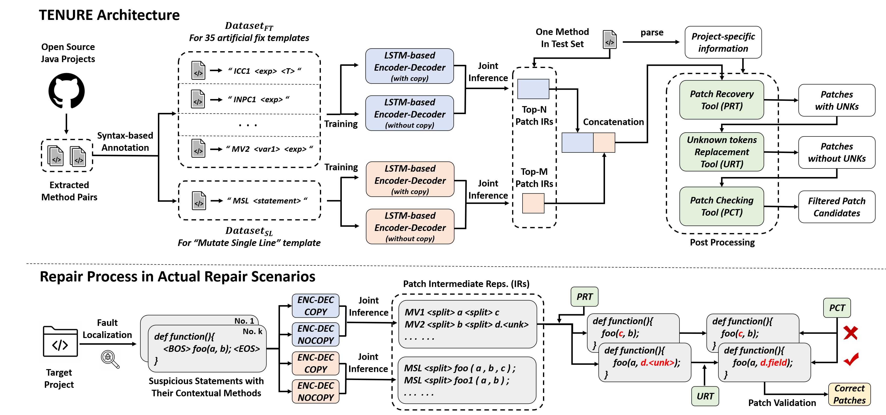

# TENURE (Template-based Neural Program Repair)

## **<font color=#FF000 >New!</font>**

### \<1\> Experimental Results of TENURE Compared with Its Template-based and NMT-based Components on Defects4J-v1.2 under Perfect Localization

| Bug Versions | Template-based Component <br> (TBar)| NMT-based Component <br> (LSTM-based Encoder-Decoder <br> with Copy Mechanism)| After Combination <br> (TENURE) |
|:------------|:----------:|:------------:|:----------:|
| Closure_10 | &#10004; |  |  |
| Closure_101 |  |  | &#10004; |
| Closure_102 | &#10004; |  | &#10004; |
| Closure_104 |  |  | &#10004; |
| Closure_115 |  |  | &#10004; |
| Closure_119 |  | &#10004; | &#10004; |
| Closure_123 |  |  | &#10004; |
| Closure_126 |  |  | &#10004; |
| Closure_13 | &#10004; |  | &#10004; |
| Closure_18 | &#10004; | &#10004; |  |
| Closure_19 |  | &#10004; | &#10004; |
| Closure_2 | &#10004; |  | &#10004; |
| Closure_21 | &#10004; |  | &#10004; |
| Closure_22 | &#10004; |  | &#10004; |
| Closure_31 | &#10004; |  | &#10004; |
| Closure_38 | &#10004; |  | &#10004; |
| Closure_40 | &#10004; | &#10004; | &#10004; |
| Closure_46 | &#10004; |  | &#10004; |
| Closure_59 |  | &#10004; |  |
| Closure_62 | &#10004; | &#10004; | &#10004; |
| Closure_63 | &#10004; | &#10004; | &#10004; |
| Closure_70 | &#10004; | &#10004; | &#10004; |
| Closure_71 |  | &#10004; | &#10004; |
| Closure_73 | &#10004; |  | &#10004; |
| Closure_79 |  |  | &#10004; |
| Closure_83 |  | &#10004; | &#10004; |
| Closure_86 | &#10004; | &#10004; | &#10004; |
| Closure_92 |  | &#10004; | &#10004; |
| Closure_93 |  | &#10004; | &#10004; |
| Chart_1 | &#10004; | &#10004; |  |
| Chart_11 | &#10004; |  |  |
| Chart_12 | &#10004; |  | &#10004; |
| Chart_14 |  |  | &#10004; |
| Chart_19 | &#10004; |  | &#10004; |
| Chart_20 | &#10004; |  |  |
| Chart_24 | &#10004; |  | &#10004; |
| Chart_26 | &#10004; | &#10004; |  |
| Chart_3 |  |  | &#10004; |
| Chart_4 | &#10004; |  | &#10004; |
| Chart_8 | &#10004; | &#10004; | &#10004; |
| Chart_9 | &#10004; |  | &#10004; |
| Lang_10 | &#10004; |  | &#10004; |
| Lang_22 | &#10004; |  | &#10004; |
| Lang_24 | &#10004; | &#10004; | &#10004; |
| Lang_26 | &#10004; |  |  |
| Lang_29 |  | &#10004; | &#10004; |
| Lang_33 | &#10004; | &#10004; | &#10004; |
| Lang_38 |  |  | &#10004; |
| Lang_39 |  | &#10004; | &#10004; |
| Lang_4 |  |  | &#10004; |
| Lang_43 |  | &#10004; | &#10004; |
| Lang_46 |  |  | &#10004; |
| Lang_47 | &#10004; |  | &#10004; |
| Lang_51 | &#10004; |  |  |
| Lang_55 |  |  | &#10004; |
| Lang_57 | &#10004; |  | &#10004; |
| Lang_59 | &#10004; | &#10004; | &#10004; |
| Lang_6 | &#10004; |  | &#10004; |
| Lang_7 |  |  | &#10004; |
| Math_105 |  |  | &#10004; |
| Math_11 | &#10004; |  | &#10004; |
| Math_22 | &#10004; | &#10004; | &#10004; |
| Math_30 | &#10004; | &#10004; | &#10004; |
| Math_34 | &#10004; |  | &#10004; |
| Math_35 | &#10004; |  | &#10004; |
| Math_4 | &#10004; |  | &#10004; |
| Math_5 | &#10004; |  |  |
| Math_50 |  |  | &#10004; |
| Math_52 |  | &#10004; | &#10004; |
| Math_56 |  | &#10004; | &#10004; |
| Math_57 | &#10004; |  | &#10004; |
| Math_58 | &#10004; |  | &#10004; |
| Math_59 | &#10004; | &#10004; | &#10004; |
| Math_65 | &#10004; | &#10004; | &#10004; |
| Math_70 | &#10004; |  | &#10004; |
| Math_75 | &#10004; |  | &#10004; |
| Math_77 | &#10004; |  | &#10004; |
| Math_79 | &#10004; |  | &#10004; |
| Math_80 | &#10004; |  | &#10004; |
| Math_82 | &#10004; |  | &#10004; |
| Math_85 | &#10004; |  | &#10004; |
| Math_89 | &#10004; |  | &#10004; |
| Math_98 | &#10004; |  |  |
| Mockito_22 |  | &#10004; | &#10004; |
| Mockito_26 | &#10004; |  | &#10004; |
| Mockito_29 | &#10004; | &#10004; | &#10004; |
| Mockito_38 | &#10004; | &#10004; | &#10004; |
| Time_19 | &#10004; |  | &#10004; |
| Time_26 | &#10004; |  | &#10004; |
| Time_4 |  | &#10004; | &#10004; |
| Time_7 | &#10004; |  |  |
| **<font color=#FF000 >Sum</font>** |  **<font color=#FF000 >62</font>** |  **<font color=#FF000 >32</font>** |  **<font color=#FF000 >79</font>** |


I. Requirements
--------------------
 #### For TENURE:
 - [Java 11](https://www.oracle.com/java/technologies/javase/jdk11-archive-downloads.html)
 - [Python 3.6](https://www.python.org/downloads/)
 - [PyTorch-1.5.1](https://pytorch.org/)
 
 
 #### For Defects4J-v1.2 dataset:
 - [Defects4J 1.2](https://github.com/rjust/defects4j/releases/tag/v1.2.0)
 - [Java 1.7](https://www.oracle.com/technetwork/java/javase/downloads/)
 - [SVN >= 1.8](https://subversion.apache.org/packages.html)
 - [Git >= 1.9](https://git-scm.com/)
 - [Perl >= 5.0.10](https://www.perl.org/get.html)
 
 
 #### For Defects4J-v2.0 dataset:
 - [Defects4J 2.0](https://github.com/rjust/defects4j/releases/tag/v2.0.0)
 - [Java 1.8](https://www.oracle.com/technetwork/java/javase/downloads/)
 - [SVN >= 1.8](https://subversion.apache.org/packages.html)
 - [Git >= 1.9](https://git-scm.com/)
 - [Perl >= 5.0.10](https://www.perl.org/get.html)
 
 


II. Overview of TENURE
--------------------




III. Download Dataset
---------------------------
1. Click the following url links and download the necessary data used in this work.

    [fault_localization.tar.gz](https://mega.nz/file/TxBUCRja#viZeeNhQri0dNDeK9E3-Bca-IgTeqBo9NuTDQWmds1s)
    
    [check_point.tar.gz](https://mega.nz/file/XwJVEZaR#Q2kHln8CQOvgpIY66YKjFfqQcGMC5a3b76j7rQvM7Ec)
    
    [dataset.tar.gz](https://mega.nz/file/6xxCFQoY#PbcHLVNbEyQsL0VZPfAmaOU5bu_rijQ1VxmMvQaBI9E)
    
    [third_party_v1.tar.gz](https://mega.nz/file/DohFQZKJ#4YJeGJdZW-tKEpqmQCd8oFKWCWx-psAbB0Izk7ca7a8)
    
    [third_party_v2.tar.gz](https://mega.nz/file/PwJlzAjK#MnsDwB0MR-1VwvVsNbqDOPhp-k9ZVyyPIuyDlqBZtDc)
    
    

2. Put them into the corresponding paths as follows and decompress them: 
    * Put `fault_localization.tar.gz` into the root dir of TENURE.
    * Put `check_point.tar.gz` into `./nmt_model/origin_onmt/`.
    * Put `dataset.tar.gz` into `./nmt_model/`.
    * Put `third_party_v1.tar.gz` into `./necessary_info/d4j_v1/`.
    * Put `third_party_v2.tar.gz` into `./necessary_info/d4j_v2/`.
    


IV. Prepare Defects4J Dataset
---------------------------
 1. Download and install [Defects4J-v1.2](https://github.com/rjust/defects4j/releases/tag/v1.2.0) and [Defects4J-v2.0](https://github.com/rjust/defects4j/releases/tag/v2.0.0), and complete the requirements in their README file.
  
 3. Export environment variable `D4J_HOME` as the root dir of Defects4J (select the corresponding Defects4J version according to the experiment settings).
 

V. Perform Repair Experiments with Already Trained Models
 --------------------------
1. Edit the confiauration of the experiments if you want. 

```
  <d4j_version>: v1 or v2
  <fl_setting>: perfect or ochiai
  <bug_version>: a bug from Defects4J-v1.2 or Defects4J-v2.0 (e.g., Chart_1)
  <beam_all>: the number of reserved patch IRs from 35 artificial fix templates and 1 single-line fix template (default: 500 for perfect and 200 for ochiai)
  <beam_35>: the number of reserved patch IRs from 35 artificial fix template (default: 300 for perfect and 120 for ochiai)
  <beam_single>: the number of reserved patch IRs from the single-line fix template (default: 200 for perfect and 80 for ochiai)
```
    
2. Enter the path `./projects/d4j_<d4j_version>/` and checkout the corresponidng bug version (e.g. Chart_1) in Defects4J-v1.2 or Defects4J-v2.0 (use Java JDK 1.7 or 1.8).
``` 
  e.g. defects4j checkout -p Chart -v 1b -w ./Chart_1
```
3. Execute `data_process.jar` (must use Java JDK 11).
```
  cd ./scripts/ && java -jar data_process.jar <d4j_version> <bug_version> <fl_setting>
```
4. Execute `run.py` (use Java JDK 1.7 or 1.8).
```
  cd ./scripts/ && python3 run.py
```
5. See the repair results in `./patch_validation/patches/` and the repair log in `./patch_validation/log/`.
```
  ./patch_validation/patches/all/: including the patches that can pass all test cases.
  ./patch_validation/patches/partial/: including the patches that can pass part of the test cases.
```
6. Manual check for these patches to judge if they are semantically correct.

* Note: we recommend executing the script `init.py` in `./scripts/` to restore the source code of the bug version to be fixed in Defects4J dataset to the original state.


VI. Train New Models to Perform Repair Experiments
---------------------------
If you want to train new models for repair experiments, the following steps can help:
1. Use the configuration files in `./nmt_model/origin_onmt/train/` for model training.
```
  Vocabulary construction (e.g.): cd ./nmt_model/origin_onmt/ && python3 build_vocab.py -config ./train/config-copy-35.yaml -n_samples -1
  Model Training (e.g.): cd ./nmt_model/origin_onmt/ && python3 train.py -config ./train/config-copy-35.yaml
```

2. Select a new model checkpoint to replace the original one procided by us.
```
  (e.g.) cd ./nmt_model/origin_onmt/check_point/copy_35/ && mv model_step_200000.pt saved_model.pt
```
        
3. Execute all the commands in Section V.

* Note: gpu options can be edited in the configuration files in `./nmt_model/origin_onmt/train/` to meet the requirements of different operating environments.


VIII. Online Appendix
-----------------------------

### 1. Twelve error-oriented functional modules designed in PCT:

| Module Names | Descriptions |
|:------------|:----------|
| Check Identifiers | Check if all identifiers can be found in the space of syntactic constraints. |
| Check Method Param. | Check if the types of method params are consistent with the declaration. |
| Check Binary Operations | Check if the operands in binary expressions satisfy the type restrictions. |
| Check Unary Operations | Check if the operand in unary expressions satisfy the type restrictions. |
| Check Array Indices | Check if the index of an array is a non-negative integer. |
| Check Assignments | Check if the types of expressions on the left and right sides of "=" are the same. |
| Check Continues & Breaks | Check if continue and break statements in a loop. |
| Check Return Types | Check if the actual return type is consistent with that of method declaration. |
| Check Basic Type References | Check if a code element of a basic type is (incorrectly) referenced. |
| Check Cast Types | Check if the identifier used in a cast expression is a class name. |
| Check Conditional Expr. | Check if the condition is a boolean type expression. |
| Check Unreachable Stmt. | Check if there is a statement that can never be reached. |


IX. Structure of the Directories
 -------------------------------
 ```
  |--- README.md                :  user guidance
  |--- overview.png             :  overview of TENURE
  |--- fault_localization       :  fault localization results (perfect or ochiai)
  |--- projects                 :  the source code of bug versions in Defects4J
  |--- necessary_info           :  some necessary information used in experiments
  |--- parsed_data              :  intermediate data in the process of patch generation
  |--- tool_set                 :  tools developed in post processing phase (prt, urt, pct)
  |--- nmt_model                :  encoder-decoder models with joint interface strategy
  |--- scripts                  :  scripts to complete some tasks such as data preprocessing
  |--- patch_validation         :  main entrance for patch validations

```
