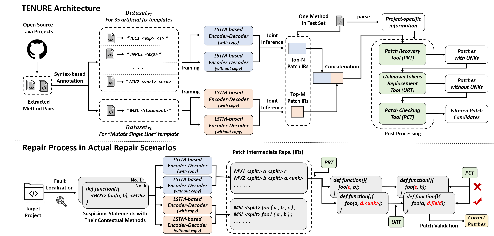

# TENURE (Template-based Neural Program Repair)

## New! \<1\> and \<2\>

## \<1\> Experimental Results of TENURE Compared with Its Template-based and NMT-based Components on Defects4J-v1.2 under Perfect Localization

| Bug Versions | Template-based Component <br> (TBar)| NMT-based Component <br> (LSTM-based Encoder-Decoder <br> with Copy Mechanism)| After Combination <br> (TENURE) |
|:------------|:----------:|:------------:|:----------:|
| Closure_10 | &#10004; |  |  |
| Closure_101 |  |  | &#10004; |
| Closure_102 | &#10004; |  | &#10004; |
| Closure_104 |  |  | &#10004; |
| Closure_115 |  |  | &#10004; |
| Closure_119 |  | &#10004; | &#10004; |
| Closure_123 |  |  | &#10004; |
| Closure_126 |  |  | &#10004; |
| Closure_13 | &#10004; |  | &#10004; |
| Closure_18 | &#10004; | &#10004; |  |
| Closure_19 |  | &#10004; | &#10004; |
| Closure_2 | &#10004; |  | &#10004; |
| Closure_21 | &#10004; |  | &#10004; |
| Closure_22 | &#10004; |  | &#10004; |
| Closure_31 | &#10004; |  | &#10004; |
| Closure_38 | &#10004; |  | &#10004; |
| Closure_40 | &#10004; | &#10004; | &#10004; |
| Closure_46 | &#10004; |  | &#10004; |
| Closure_59 |  | &#10004; |  |
| Closure_62 | &#10004; | &#10004; | &#10004; |
| Closure_63 | &#10004; | &#10004; | &#10004; |
| Closure_70 | &#10004; | &#10004; | &#10004; |
| Closure_71 |  | &#10004; | &#10004; |
| Closure_73 | &#10004; |  | &#10004; |
| Closure_79 |  |  | &#10004; |
| Closure_83 |  | &#10004; | &#10004; |
| Closure_86 | &#10004; | &#10004; | &#10004; |
| Closure_92 |  | &#10004; | &#10004; |
| Closure_93 |  | &#10004; | &#10004; |
| Chart_1 | &#10004; | &#10004; |  |
| Chart_11 | &#10004; |  |  |
| Chart_12 | &#10004; |  | &#10004; |
| Chart_14 |  |  | &#10004; |
| Chart_19 | &#10004; |  | &#10004; |
| Chart_20 | &#10004; |  |  |
| Chart_24 | &#10004; |  | &#10004; |
| Chart_26 | &#10004; | &#10004; |  |
| Chart_3 |  |  | &#10004; |
| Chart_4 | &#10004; |  | &#10004; |
| Chart_8 | &#10004; | &#10004; | &#10004; |
| Chart_9 | &#10004; |  | &#10004; |
| Lang_10 | &#10004; |  | &#10004; |
| Lang_22 | &#10004; |  | &#10004; |
| Lang_24 | &#10004; | &#10004; | &#10004; |
| Lang_26 | &#10004; |  |  |
| Lang_29 |  | &#10004; | &#10004; |
| Lang_33 | &#10004; | &#10004; | &#10004; |
| Lang_38 |  |  | &#10004; |
| Lang_39 |  | &#10004; | &#10004; |
| Lang_4 |  |  | &#10004; |
| Lang_43 |  | &#10004; | &#10004; |
| Lang_46 |  |  | &#10004; |
| Lang_47 | &#10004; |  | &#10004; |
| Lang_51 | &#10004; |  |  |
| Lang_55 |  |  | &#10004; |
| Lang_57 | &#10004; |  | &#10004; |
| Lang_59 | &#10004; | &#10004; | &#10004; |
| Lang_6 | &#10004; |  | &#10004; |
| Lang_7 |  |  | &#10004; |
| Math_105 |  |  | &#10004; |
| Math_11 | &#10004; |  | &#10004; |
| Math_22 | &#10004; | &#10004; | &#10004; |
| Math_30 | &#10004; | &#10004; | &#10004; |
| Math_34 | &#10004; |  | &#10004; |
| Math_35 | &#10004; |  | &#10004; |
| Math_4 | &#10004; |  | &#10004; |
| Math_5 | &#10004; |  |  |
| Math_50 |  |  | &#10004; |
| Math_52 |  | &#10004; | &#10004; |
| Math_56 |  | &#10004; | &#10004; |
| Math_57 | &#10004; |  | &#10004; |
| Math_58 | &#10004; |  | &#10004; |
| Math_59 | &#10004; | &#10004; | &#10004; |
| Math_65 | &#10004; | &#10004; | &#10004; |
| Math_70 | &#10004; |  | &#10004; |
| Math_75 | &#10004; |  | &#10004; |
| Math_77 | &#10004; |  | &#10004; |
| Math_79 | &#10004; |  | &#10004; |
| Math_80 | &#10004; |  | &#10004; |
| Math_82 | &#10004; |  | &#10004; |
| Math_85 | &#10004; |  | &#10004; |
| Math_89 | &#10004; |  | &#10004; |
| Math_98 | &#10004; |  |  |
| Mockito_22 |  | &#10004; | &#10004; |
| Mockito_26 | &#10004; |  | &#10004; |
| Mockito_29 | &#10004; | &#10004; | &#10004; |
| Mockito_38 | &#10004; | &#10004; | &#10004; |
| Time_19 | &#10004; |  | &#10004; |
| Time_26 | &#10004; |  | &#10004; |
| Time_4 |  | &#10004; | &#10004; |
| Time_7 | &#10004; |  |  |
| **Sum** |  **62** |  **32** |  **79** |

We use the symbol V for union and &Lambda; for intersection, and S indicates the set of fixed bugs. From the table, suppose:

***S1 = S(TBar) &Lambda; S(TENURE), &emsp; S2 = S(NMT) &Lambda; S(TENURE), &emsp; S3 = S1 V S2, &emsp; S4 = S(TENURE) - S3***,

the numbers of bugs in these sets are as follows:

***\#(S1) = 51, &emsp;&emsp; \#(S2) = 28, &emsp;&emsp; \#(S3) = 64, &emsp;&emsp; \#(S4) = 15.***

Therefore, 64 fixed bugs are contributed by template-based and NMT-based components, while ***15 bugs benefit from <br> the combination method implemented in TENURE***. 

---

## \<2\> More Explanations for 36 (35+1) Fix Templates and The Corresponding Patch IRs.

| No. | Fix Templates | Definitions of Repair Actions | Patch IRs|
|:------------:|:----------|:------------|:----------|
| 1 | Insert Cast <br> Checker 1 | + &emsp; if (***exp*** instanceof ***T***){<br>&emsp;&emsp;&emsp;&emsp; var = (***T***) ***exp*** ; <br> + &emsp; } | ICC1 \<exp\> \<T\> |
| 2 | Insert Null Pointer <br> Checker 1 | + &emsp; if (***exp*** != null){<br>&emsp;&emsp;&emsp;&emsp; ... ***exp*** ... ;<br> + &emsp; } | INPC1 \<exp\> |
| 3 | Insert Null Pointer <br> Checker 2 | + &emsp; if (***exp*** == null)<br>+ &emsp;&emsp;&emsp; return ***default*** ; <br>&emsp;&emsp; ... ***exp*** ... ; | INPC2 \<exp\> \<default\> |
| 4 | Insert Null Pointer <br> Checker 3 | + &emsp; if (***exp*** == null)<br>+ &emsp;&emsp;&emsp; ***exp*** = ***exp1*** ; <br>&emsp;&emsp; ... ***exp*** ... ; | INPC3 \<exp\> \<exp1\> |
| 5 | Insert Null Pointer <br> Checker 4 | + &emsp; if (***exp*** == null)<br>+ &emsp;&emsp;&emsp; continue ; <br>&emsp;&emsp; ... ***exp*** ... ; | INPC4 \<exp\> |
| 6 | Insert Null Pointer <br> Checker 5 | + &emsp; if (***exp*** == null)<br>+ &emsp;&emsp;&emsp; throw new <br> + &emsp;&emsp;&emsp; IllegalArgumentException(...) ; <br>&emsp;&emsp; ... ***exp*** ... ; | INPC5 \<exp\> |
| 7 | Insert Range <br> Checker 1 | + &emsp; if (***index*** &lt; ***exp***.length){<br>&emsp;&emsp;&emsp;&emsp; ... ***exp***\[***index***\] ... ; <br> + &emsp; } | IRC1 \<exp\> \<index\> |
| 8 | Insert Range <br> Checker 2 | + &emsp; if (***index*** &lt; ***exp***.size()){<br>&emsp;&emsp;&emsp;&emsp; ... ***exp***.get(***index***) ... ; <br> + &emsp; } | IRC2 \<exp\> \<index\> |
| 9 | Insert Missed <br> Statement 1 | + &emsp; ***expression_statement*** ; | IMS1 \<expression_statement\> |
| 10 | Insert Missed <br> Statement 2 | + &emsp; return ***default*** ; | IMS2 \<default\> |
| 11 | Insert Missed <br> Statement 3 | + &emsp; try{<br>&emsp;&emsp;&emsp;&emsp; statement ; ... <br> + &emsp; catch (Exception e) { ... } | IMS3 |
| 12 | Insert Missed <br> Statement 4 | + &emsp; if (***conditional_exp***){<br>&emsp;&emsp;&emsp;&emsp; statement ; ... <br> + &emsp; } | IMS4 \<conditional_exp\> |
| 13 | Remove Buggy <br> Statement 1 | &emsp;&emsp;...... <br> - &emsp; statement ; <br>&emsp;&emsp;...... | RBS1 |
| 14 | Move <br> Statement 1 | - &emsp; statement ; <br>&emsp;&emsp;......(***move_step***) <br>+ &emsp;statement ;| MS1 \<move_step\> |
| 15 | Mutate <br> Conditional <br> Expression 1 | - &emsp; ... ***cExpr1*** ... ; <br> + &emsp;... ***cExpr2*** ... ; | MCE1 \<cExp1\> \<cExp2\> |
| 16 | Mutate <br> Conditional <br> Expression 2 | - &emsp; ... cExpr1 ***op*** ***cExpr2*** ... ; <br> + &emsp;... cExpr1 ... ; | MCE2 \<op\> \<cExp2\> |
| 17 | Mutate <br> Conditional <br> Expression 3 | - &emsp; ... ***cExpr1*** ... ; <br> + &emsp;... ***cExpr1*** ***op*** ***cExpr2*** ... ; | MCE3 \<cExp1\> \<op\> \<cExp2\> |
| 18 | Mutate <br> Class Instance <br> Creation 1 |&emsp;&emsp;public Object clone(){ <br> - &emsp;&emsp;&emsp; ... new T() ; <br> + &emsp;&emsp;&emsp;(T) super.clone() ; <br>&emsp;&emsp; } | MCIC1 |
| 19 | Mutate Data <br> Type 1 | - &emsp; ***T1*** var ... ; <br> + &emsp;***T2*** var ... ; | MDT1 \<T1\> \<T2\> |
| 20 | Mutate Data <br> Type 2 | - &emsp; ... (***T1***) exp ... ; <br> + &emsp;... (***T2***) exp ... ; | MDT2 \<T1\> \<T2\> |
| 21 | Mutate Integer <br> Division <br> Operation 1 | - &emsp; ... dividend / ***divisor*** ... <br> + &emsp;... dividend / (double or float) ***divisor*** ... | MIDO1 \<divisor\> |
| 22 | Mutate Integer <br> Division <br> Operation 2 | - &emsp; ... ***dividend*** / divisor ... <br> + &emsp;... (double or float) ***dividend*** / divisor ... | MIDO2 \<dividend\> |
| 23 | Mutate Integer <br> Division <br> Operation 3 | - &emsp; ... ***dividend*** / ***divisor*** ... <br> + &emsp;... (1.0 / ***divisor***) \* ***dividend*** ... | MIDO3 \<dividend\> \<divisor\> |
| 24 | Mutate Literal <br> Expression 1 | - &emsp; ... ***literal1*** ... <br> + &emsp;... ***literal2*** ... | MLE1 \<literal1\> \<literal2\> |
| 25 | Mutate Literal <br> Expression 2 | - &emsp; ... ***literal1*** ... <br> + &emsp;... ***exp*** ... | MLE2 \<literal1\> \<exp\> |
| 26 | Mutate Method <br> Invocation <br> Expression 1 | - &emsp; ... ***method1***(args) ... <br> + &emsp;... ***method2***(args) ... | MMIE1 \<method1\> \<method2\> |
| 27 | Mutate Method <br> Invocation <br> Expression 2 | - &emsp; ... method1(arg1, ***arg2***, ***arg3***, ...) ... <br> + &emsp;... method1(arg1, ***arg4***, ***arg5***, ...) ... | MMIE2 \<\[arg2, arg3\]\> \<\[arg4, arg5\]\> |
| 28 | Mutate Method <br> Invocation <br> Expression 3 | - &emsp; ... method1(arg1, ***arg2***, ***arg3***, ...) ... <br> + &emsp;... method1(arg1, ...) ... | MMIE3 \<\[arg2, arg3\]\> |
| 29 | Mutate Method <br> Invocation <br> Expression 4 | - &emsp; ... method1(***arg2***, ***arg4***, ...) ... <br> + &emsp;... method1(***arg1***, ***arg2***, ***arg3***, ***arg4***, ...) ... | MMIE4 \<\[arg2, arg4\]\> \<\[arg1, arg3\]\>|
| 30 | Mutate <br> Operators 1 | - &emsp; ... exp1 ***op1*** exp2 ... <br> + &emsp;... exp1 ***op2*** exp2 ... | MO1 \<op1\> \<op2\> |
| 31 | Mutate <br> Operators 2 | - &emsp; ... (***exp1 op1 exp2***) op2 exp3 ... <br> + &emsp;... exp1 op1 (***exp2 op2 exp3***) ... | MO2 \<exp1 op1 exp2\> \<exp2 op2 exp3\> |
| 32 | Mutate <br> Operators 3 | - &emsp; ... ***exp*** instanceof ***T*** ... <br> + &emsp;... ***exp*** != null ... | MO3 \<exp\> \<T\> |
| 33 | Mutate Return <br> Statement 1 | - &emsp; return ***exp1*** ; <br> + &emsp;return ***exp2*** ; | MRS1 \<exp1\> \<exp2\> |
| 34 | Mutate <br> Variable 1 | - &emsp; ... ***var1*** ... <br> + &emsp;... ***var2*** ... | MV1 \<var1\> \<var2\> |
| 35 | Mutate <br> Variable 2 | - &emsp; ... ***var1*** ... <br> + &emsp;... ***exp*** ... | MV2 \<var1\> \<exp\> |
| 36 | Mutate <br> Single Line | - &emsp; before_statement ; <br> + &emsp;***after_statement*** ; | MSL \<after_statement\> |

---

## \<3\> Top-2000 Java Projects Used in TENURE.

After careful checking, 8 projects appeared in both Top-2000 projects and Defects4J (v1.2 & v2.0) dataset, so the remaining 1992 projects are used in TENURE as follows:

| Top-1 to Top-500 | Top-501 to Top-1000 | Top-1001 to Top-1500 | Top-1501 to Top-2000 |
|:------------|:----------|:------------|:----------|
| CyC2018/CS-Notes | jOOQ/jOOQ | jacoco/jacoco | videlalvaro/gifsockets |
| Snailclimb/JavaGuide | vavr-io/vavr | brianway/webporter | DV8FromTheWorld/JDA |
| iluwatar/java-design-patterns | pedrovgs/AndroidWiFiADB | graknlabs/grakn | jaredrummler/AndroidProcesses |
| MisterBooo/LeetCodeAnimation | quartz-scheduler/quartz | Comcast/FreeFlow | JZXiang/TimePickerDialog |
| elastic/elasticsearch | grantland/android-autofittextview | sucese/android-open-source-project-analysis | bytedeco/javacpp-presets |
| spring-projects/spring-boot | razerdp/BasePopup | path/android-priority-jobqueue | stepstone-tech/android-material-stepper |
| doocs/advanced-java | gephi/gephi | voldemort/voldemort | maoruibin/TranslateApp |
| kdn251/interviews | techGay/v9porn | osmandapp/OsmAnd | geometer/FBReaderJ |
| macrozheng/mall | hazelcast/hazelcast | JeremyLiao/LiveEventBus | LuckyZXL2016/Movie_Recommend |
| ReactiveX/RxJava | AriaLyy/Aria | zendesk/maxwell | prometheus/jmx_exporter |
| spring-projects/spring-framework | makovkastar/FloatingActionButton | 2dxgujun/AndroidTagGroup | spring-projects/spring-batch |
| google/guava | awangdev/LintCode | konifar/android-material-design-icon-generator-plugin | yuzhiqiang1993/zxing |
| square/okhttp | Yalantis/Phoenix | bingoogolapple/BGABadgeView-Android | dodola/HotFix |
| square/retrofit | hustcc/JS-Sorting-Algorithm | alibaba/QLExpress | moquette-io/moquette |
| apache/dubbo | robinhood/ticker | jindrapetrik/jpexs-decompiler | jokermonn/permissions4m |
| TheAlgorithms/Java | hugeterry/CoordinatorTabLayout | zjw-swun/AppMethodOrder | linkedin/cruise-control |
| PhilJay/MPAndroidChart | sofastack/sofa-boot | pwittchen/ReactiveNetwork | mayubao/KuaiChuan |
| bumptech/glide | alibaba/jvm-sandbox | JakeWharton/RxRelay | kanwangzjm/funiture |
| airbnb/lottie-android | Meituan-Dianping/Leaf | VictorAlbertos/RxCache | liuyubobobo/Play-with-Data-Structures |
| Blankj/AndroidUtilCode | yasserg/crawler4j | AigeStudio/WheelPicker | normanmaurer/netty-in-action |
| kon9chunkit/GitHub-Chinese-Top-Charts | baoyachi/StepView | elye/loaderviewlibrary | dromara/raincat |
| zxing/zxing | debezium/debezium | Zomato/AndroidPhotoFilters | tumblr/Backboard |
| proxyee-down-org/proxyee-down | ChadCSong/ShineButton | VerbalExpressions/JavaVerbalExpressions | Ramotion/circle-menu-android |
| JakeWharton/butterknife | lingochamp/okdownload | jtablesaw/tablesaw | xiaoyaoyou1212/XSnow |
| crossoverJie/JCSprout | Jacksgong/JKeyboardPanelSwitch | Pay-Group/best-pay-sdk | TakahikoKawasaki/nv-websocket-client |
| netty/netty | Jasonchenlijian/FastBle | tiann/understand-plugin-framework | Q42/AndroidScrollingImageView |
| skylot/jadx | rubensousa/ViewPagerCards | square/tape | tchiotludo/akhq |
| ityouknow/spring-boot-examples | rengwuxian/RxJavaSamples | AlexLiuSheng/CheckVersionLib | yaphone/itchat4j |
| eugenp/tutorials | alibaba/jstorm | spring-io/initializr | Cutta/GifView |
| alibaba/arthas | bingoogolapple/BGABanner-Android | FudanNLP/fnlp | mozilla-mobile/focus-android |
| NationalSecurityAgency/ghidra | dinuscxj/LoadingDrawable | daimajia/AnimationEasingFunctions | Tencent/soter |
| ctripcorp/apollo | auth0/java-jwt | awaitility/awaitility | googlearchive/tiger |
| greenrobot/EventBus | BoltsFramework/Bolts-Android | android-cjj/JJSearchViewAnim | VoltDB/voltdb |
| alibaba/druid | apache/groovy | apache/nifi | hongyangAndroid/AndroidChangeSkin |
| alibaba/fastjson | JoanZapata/android-iconify | Ramotion/paper-onboarding-android | eluleci/FlatUI |
| geekxh/hello-algorithm | CellularPrivacy/Android-IMSI-Catcher-Detector | BaronZ88/MinimalistWeather | soabase/exhibitor |
| scwang90/SmartRefreshLayout | apache/lucene-solr | oasisfeng/condom | huxq17/XRefreshView |
| CymChad/BaseRecyclerViewAdapterHelper | confluentinc/ksql | apache/curator | Yalantis/Taurus |
| Netflix/Hystrix | YunaiV/onemall | LaiFeng-Android/SopCastComponent | anitaa1990/Android-Cheat-sheet |
| lenve/vhr | raphw/byte-buddy | liquibase/liquibase | Cleveroad/WaveInApp |
| xkcoding/spring-boot-demo | airbnb/DeepLinkDispatch | xmuSistone/CardSlidePanel | alexvasilkov/FoldableLayout |
| SeleniumHQ/selenium | qstumn/BadgeView | zhouchaoyuan/excelPanel | wasabeef/picasso-transformations |
| ReactiveX/RxAndroid | reactive-streams/reactive-streams-jvm | Krupen/FabulousFilter | roncoo/spring-boot-demo |
| hollischuang/toBeTopJavaer | alibaba/Tangram-Android | yanzhenjie/Album | luxiaoxun/NettyRpc |
| seata/seata | aurelhubert/ahbottomnavigation | mongodb/mongo-java-driver | AlmasB/FXGL |
| alibaba/easyexcel | lcodecorex/TwinklingRefreshLayout | cabaletta/baritone | maurycyw/StaggeredGridView |
| libgdx/libgdx | Meituan-Dianping/Robust | jOOQ/jOOR | Sayi/poi-tl |
| wuyouzhuguli/SpringAll | roboguice/roboguice | JessYanCoding/ProgressManager | Qihoo360/XLearning |
| square/picasso | apache/hbase | iammert/MaterialIntroView | ImmortalZ/StereoView |
| zhangdaiscott/jeecg-boot | roncoo/roncoo-pay | nutzam/nutz | SpringCloud/spring-cloud-code |
| apache/kafka | Netflix/ribbon | igreenwood/SimpleCropView | react-native-kit/react-native-track-player |
| qiurunze123/miaosha | ongakuer/CircleIndicator | team-supercharge/ShimmerLayout | yidongnan/grpc-spring-boot-starter |
| halo-dev/halo | codingapi/tx-lcn | gcacace/android-signaturepad | scouter-project/scouter |
| chrisbanes/PhotoView | cjlin1/libsvm | SufficientlySecure/html-textview | liuguangqiang/SwipeBack |
| alibaba/canal | chillzhuang/SpringBlade | Rukey7/MvpApp | klinker24/talon-twitter-holo |
| looly/hutool | deathmarine/Luyten | aistrate/AlgorithmsSedgewick | Neamar/KISS |
| dbeaver/dbeaver | 2227324689/gpmall | mcxtzhang/ZLayoutManager | athkalia/Just-Another-Android-App |
| google/ExoPlayer | alipay/SoloPi | apache/maven | wuyr/PathLayoutManager |
| nostra13/Android-Universal-Image-Loader | spring-projects/spring-data-examples | halirutan/IntelliJ-Key-Promoter-X | akexorcist/BluetoothSPPLibrary |
| alibaba/spring-cloud-alibaba | Manabu-GT/ExpandableTextView | spring-projects/spring-data-elasticsearch | Tibolte/ElasticDownload |
| jenkinsci/jenkins | xcltapestry/XCL-Charts | yqritc/RecyclerView-FlexibleDivider | linkedin/kafka-monitor |
| xuxueli/xxl-job | cglib/cglib | JsonChao/Awesome-WanAndroid | Trinea/android-auto-scroll-view-pager |
| facebook/fresco | bitcoinj/bitcoinj | balysv/material-ripple | javiersantos/AppUpdater |
| didi/DoraemonKit | ThirtyDegreesRay/OpenHub | chenupt/SpringIndicator | qyxxjd/MultipleStatusView |
| bazelbuild/bazel | MiguelCatalan/MaterialSearchView | square/keywhiz | beefe/react-native-picker |
| shuzheng/zheng | bluelinelabs/Conductor | hefuyicoder/ListenerMusicPlayer | modelmapper/modelmapper |
| Tencent/tinker | orhanobut/hawk | spotify/dockerfile-maven | KikiLetGo/VirusBroadcast |
| apache/skywalking | software-mansion/react-native-gesture-handler | javamelody/javamelody | ImmortalZ/TransitionHelper |
| CarGuo/GSYVideoPlayer | twowaits/SDE-Interview-Questions | sannies/mp4parser | frogermcs/LikeAnimation |
| alibaba/nacos | baidu/uid-generator | qiujuer/Genius-Android | nisrulz/easydeviceinfo |
| redisson/redisson | stleary/JSON-java | real-logic/simple-binary-encoding | pwnall/chromeview |
| linlinjava/litemall | JanusGraph/janusgraph | grandcentrix/tray | uccmawei/FingerprintIdentify |
| apache/flink | frohoff/ysoserial | zlt2000/microservices-platform | heinrichreimer/material-intro |
| mybatis/mybatis-3 | objectbox/objectbox-java | Frank-Zhu/PullZoomView | dersoncheng/MultipleTheme |
| alibaba/Sentinel | yanzhenjie/NoHttp | vikramkakkar/SublimePicker | evant/binding-collection-adapter |
| dianping/cat | LawnchairLauncher/Lawnchair | jeasonlzy/NineGridView | singwhatiwanna/android-art-res |
| forezp/SpringCloudLearning | iNPUTmice/Conversations | KFCFans/PowerJob | dinuscxj/RecyclerRefreshLayout |
| android10/Android-CleanArchitecture | Nepxion/Discovery | zalando/zalenium | kymjs/TheMVP |
| brettwooldridge/HikariCP | timehop/sticky-headers-recyclerview | florent37/CameraFragment | soot-oss/soot |
| winterbe/java8-tutorial | javagrowing/JGrowing | KeepSafe/ReLinker | confluentinc/kafka-rest |
| oracle/graal | Exrick/xpay | nanchen2251/CompressHelper | mancj/SlideUp-Android |
| signalapp/Signal-Android | zhanglei-workspace/shopping-management-system | Diolor/Swipecards | Sunzxyong/Recovery |
| EnterpriseQualityCoding/FizzBuzzEnterpriseEdition | lettuce-io/lettuce-core | code-mc/material-icon-lib | software-mansion/react-native-screens |
| openzipkin/zipkin | Piasy/BigImageViewer | androidx/androidx | wenmingvs/NotifyUtil |
| JeffLi1993/springboot-learning-example | phishman3579/java-algorithms-implementation | lingcimi/jjdxm_ijkplayer | MindorksOpenSource/android-developer-roadmap |
| lottie-react-native/lottie-react-native | microsoft/malmo | svga/SVGAPlayer-Android | shyiko/mysql-binlog-connector-java |
| hdodenhof/CircleImageView | google/google-java-format | H07000223/FlycoDialog_Master | florent37/GlidePalette |
| lgvalle/Material-Animations | yhaolpz/FloatWindow | Kyson/AndroidGodEye | tangqi92/WaveLoadingView |
| LMAX-Exchange/disruptor | rockerhieu/emojicon | Qihoo360/ArgusAPM | pinterest/secor |
| apache/rocketmq | Freeyourgadget/Gadgetbridge | twitter/distributedlog | sanshengshui/netty-learning-example |
| elunez/eladmin | nytimes/Store | igniterealtime/Openfire | apache/servicecomb-java-chassis |
| apache/shardingsphere | youtube/api-samples | JingYeoh/FragmentRigger | dexafree/MaterialList |
| alibaba/ARouter | johncarl81/parceler | markushi/android-ui | kanytu/android-parallax-recyclerview |
| orhanobut/logger | hansonwang99/Spring-Boot-In-Action | Yalantis/Euclid | vaadin/framework |
| Tencent/QMUI_Android | luckybilly/CC | Picovoice/porcupine | intel-isl/OpenBot |
| dyc87112/SpringBoot-Learning | amirzaidi/Launcher3 | h2oai/h2o-2 | dooboolab/react-native-iap |
| Bigkoo/Android-PickerView | oldmanpushcart/greys-anatomy | OCNYang/Android-Animation-Set | corona-warn-app/cwa-server |
| greenrobot/greenDAO | yangfuhai/ASimpleCache | theDazzler/droidicon | spring-cloud/spring-cloud-config |
| Curzibn/Luban | flowable/flowable-engine | pinguo-zhouwei/MZBannerView | HuanTanSheng/EasyPhotos |
| facebookarchive/stetho | plantuml/plantuml | Tencent/VasDolly | warkiz/IndicatorSeekBar |
| daimajia/AndroidSwipeLayout | lzyzsd/CircleProgress | zmxv/react-native-sound | harism/android-pagecurl |
| eclipse/deeplearning4j | zzhoujay/RichText | xinghongfei/LookLook | jmxtrans/jmxtrans |
| TeamNewPipe/NewPipe | litesuits/android-common | AdoptOpenJDK/jitwatch | fabric8io/kubernetes-client |
| Konloch/bytecode-viewer | brianway/java-learning | liyiorg/weixin-popular | Jungerr/GridPasswordView |
| zhihu/Matisse | ryanhoo/StylishMusicPlayer | alibaba/TProfiler | mayubao/Android-Pay |
| daimajia/AndroidViewAnimations | databricks/learning-spark | TheFinestArtist/FinestWebView-Android | rosenpin/fading-text-view |
| material-components/material-components-android | apache/ignite | tdebatty/java-string-similarity | xmuSistone/VerticalSlideFragment |
| eclipse-vertx/vert.x | ElderDrivers/EdXposed | oracle/helidon | bephrem1/backtobackswe |
| prestodb/presto | natario1/CameraView | google/wycheproof | jphp-group/jphp |
| jfeinstein10/SlidingMenu | luontola/retrolambda | soarcn/BottomSheet | franmontiel/PersistentCookieJar |
| apache/hadoop | dongjunkun/DropDownMenu | Netflix/archaius | WangShuo1143368701/WSLiveDemo |
| Tencent/VasSonic | CalebFenton/simplify | killbill/killbill | yale8848/CacheWebView |
| androidannotations/androidannotations | tyrantgit/ExplosionField | Swagger2Markup/swagger2markup | stagemonitor/stagemonitor |
| medcl/elasticsearch-analysis-ik | baoyongzhang/SwipeMenuListView | cucumber/cucumber-jvm | AAkira/ExpandableLayout |
| realm/realm-java | apache/camel | xuuhaoo/OkSocket | xerial/sqlite-jdbc |
| iBotPeaches/Apktool | codeestX/GeekNews | qunarcorp/qmq | JessYanCoding/ArmsComponent |
| pinpoint-apm/pinpoint | lsjwzh/RecyclerViewPager | mybatis/spring | robovm/robovm |
| android-hacker/VirtualXposed | apache/incubator-heron | Prototik/HoloEverywhere | zeebe-io/zeebe |
| JessYanCoding/AndroidAutoSize | openhab/openhab1-addons | jitsi/jitsi-videobridge | chatopera/cskefu |
| arduino/Arduino | oblac/jodd | android/location-samples | daimajia/AnimeTaste |
| youth5201314/banner | xcc3641/SeeWeather | DiUS/java-faker | GeyserMC/Geyser |
| alibaba/vlayout | arimorty/floatingsearchview | signalapp/Signal-Server | uber/piranha |
| android-async-http/android-async-http | ZHENFENG13/spring-boot-projects | OpenHFT/Chronicle-Queue | unclebob/fitnesse |
| Yalantis/uCrop | iSoron/uhabits | AxonFramework/AxonFramework | eschao/android-PageFlip |
| permissions-dispatcher/PermissionsDispatcher | kikoso/android-stackblur | Naoki2015/CircleDemo | mattdesl/lwjgl-basics |
| apache/druid | ronmamo/reflections | dmilicic/Android-Clean-Boilerplate | scalad/Note |
| lipangit/JiaoZiVideoPlayer | Atmosphere/atmosphere | iMeiji/Toutiao | sanluan/PublicCMS |
| JakeWharton/ViewPagerIndicator | chewiebug/GCViewer | skyfishjy/android-ripple-background | FreeTymeKiyan/LeetCode-Sol-Res |
| Netflix/zuul | pqpo/SmartCropper | square/mortar | inmite/android-selector-chapek |
| jeasonlzy/okhttp-OkGo | azkaban/azkaban | fossasia/phimpme-android | smartloli/kafka-eagle |
| H07000223/FlycoTabLayout | apache/hive | zcweng/SwitchButton | florent37/ArcLayout |
| baomidou/mybatis-plus | willowtreeapps/spruce-android | RipMeApp/ripme | BakerJQ/Android-InfiniteCards |
| GoogleContainerTools/jib | rstudio/rstudio | QNJR-GROUP/EasyTransaction | mercyblitz/thinking-in-spring-boot-samples |
| Netflix/eureka | sunfusheng/MarqueeView | apache/calcite | Arello-Mobile/Moxy |
| tbruyelle/RxPermissions | ming1016/study | LuckyJayce/LargeImage | Qihoo360/Quicksql |
| lingochamp/FileDownloader | eirslett/frontend-maven-plugin | sqlcipher/android-database-sqlcipher | traex/ExpandableLayout |
| pagehelper/Mybatis-PageHelper | aws/aws-sdk-java | android-cjj/BeautifulRefreshLayout | gchq/Gaffer |
| JessYanCoding/MVPArms | avast/android-butterknife-zelezny | addthis/stream-lib | omadahealth/LolliPin |
| google/guice | bilibili/MagicaSakura | avast/android-styled-dialogs | square/assertj-android |
| rzwitserloot/lombok | binIoter/GuideView | unofficial-openjdk/openjdk | luizgrp/SectionedRecyclerViewAdapter |
| liaohuqiu/android-Ultra-Pull-To-Refresh | zuihou/zuihou-admin-cloud | ikarus23/MifareClassicTool | qiujiayu/AutoLoadCache |
| LuckSiege/PictureSelector | dropbox/hackpad | fossasia/susi_server | JetBrains/intellij-plugins |
| justauth/JustAuth | JakeWharton/ThreeTenABP | stormzhang/9GAG | willowtreeapps/Hyperion-Android |
| YoKeyword/Fragmentation | javaparser/javaparser | federicoiosue/Omni-Notes | YummyLau/PanelSwitchHelper |
| ksoichiro/Android-ObservableScrollView | yigit/android-priority-jobqueue | killme2008/aviatorscript | eclipse/eclipse-collections |
| redis/jedis | mercyblitz/tech-weekly | PhilippC/keepass2android | yydcdut/PhotoNoter |
| sqshq/piggymetrics | dreamhead/moco | JPressProjects/jpress | githubwing/DragPhotoView |
| pockethub/PocketHub | alibaba/COLA | bitcoin-wallet/bitcoin-wallet | spotify/apollo |
| code4craft/webmagic | brianfrankcooper/YCSB | gongwen/MarqueeViewLibrary | airsonic/airsonic |
| 81813780/AVLoadingIndicatorView | andremion/Music-Player | geoserver/geoserver | D-clock/AndroidDaemonService |
| aosp-mirror/platform_frameworks_base | vespa-engine/vespa | niorgai/StatusBarCompat | ehcache/ehcache3 |
| java-decompiler/jd-gui | ivacf/archi | Netflix/concurrency-limits | neokree/MaterialNavigationDrawer |
| codecentric/spring-boot-admin | hussien89aa/AndroidTutorialForBeginners | xfumihiro/ViewInspector | leochuan/ViewPagerLayoutManager |
| seaswalker/spring-analysis | guolindev/giffun | pilgr/Paper | xmindltd/xmind |
| Tencent/APIJSON | davideas/FlexibleAdapter | igniterealtime/Smack | Jasonette/JASONETTE-Android |
| mission-peace/interview | JZ-Darkal/AndroidHttpCapture | google/truth | MostafaGazar/CustomShapeImageView |
| umano/AndroidSlidingUpPanel | mapstruct/mapstruct | apache/nutch | julian-klode/dns66 |
| frank-lam/fullstack-tutorial | kiegroup/drools | steelkiwi/cropiwa | hehonghui/AndroidEventBus |
| navasmdc/MaterialDesignLibrary | dromara/hmily | andpor/react-native-sqlite-storage | aosp-mirror/platform_frameworks_support |
| daniulive/SmarterStreaming | powermock/powermock | zhangkaitao/es | WinterChenS/my-site |
| wasabeef/glide-transformations | theonedev/onedev | elvishew/xLog | kilim/kilim |
| gyf-dev/ImmersionBar | bjmashibing/InternetArchitect | balsikandar/Android-Studio-Plugins | jenly1314/KingTV |
| google/auto | bytedeco/javacpp | android-cjj/Android-MaterialRefreshLayout | getActivity/XXPermissions |
| nathanmarz/storm | reactor/reactor-core | fython/MaterialStepperView | noties/Markwon |
| antlr/antlr4 | crossoverJie/SSM | mqzhangw/JIMU | LogNet/grpc-spring-boot-starter |
| perwendel/spark | actorapp/actor-platform | http-kit/http-kit | liangfeidotme/AndroidRubberIndicator |
| hyb1996/Auto.js | CameraKit/blurkit-android | oshi/oshi | jenly1314/ZXingLite |
| apache/zookeeper | lygttpod/SuperTextView | nextcloud/android | EsotericSoftware/kryonet |
| ben-manes/caffeine | jhalterman/failsafe | Devlight/NavigationTabStrip | kairosdb/kairosdb |
| chrisbanes/Android-PullToRefresh | coobird/thumbnailator | rmtheis/android-ocr | JetBrains/skija |
| zhisheng17/flink-learning | apache/shiro | vdurmont/emoji-java | hekailiang/squirrel |
| googlesamples/easypermissions | stfalcon-studio/ChatKit | Yalantis/Horizon | ladingwu/dimens_sw |
| react-native-camera/react-native-camera | alamkanak/Android-Week-View | Ramotion/cardslider-android | x-ream/sqli |
| janishar/mit-deep-learning-book-pdf | google/open-location-code | alexvasilkov/GestureViews | raxod502/TerrariaClone |
| bilibili/DanmakuFlameMaster | bisq-network/bisq | gjiazhe/PanoramaImageView | rohitghatol/spring-boot-microservices |
| lionsoul2014/ip2region | apache/rocketmq-externals | jgilfelt/android-sqlite-asset-helper | spring-projects/spring-session |
| YunaiV/SpringBoot-Labs | AntennaPod/AntennaPod | nex3z/FlowLayout | aserbao/AndroidCamera |
| clojure/clojure | bluelinelabs/LoganSquare | BeesX/BeesAndroid | connectbot/connectbot |
| chrisjenx/Calligraphy | tangqi92/Android-Tips | chrisbanes/philm | limpoxe/Android-Plugin-Framework |
| koral--/android-gif-drawable | shekhargulati/99-problems | mcharmas/Android-ReactiveLocation | nispok/snackbar |
| paascloud/paascloud-master | Ereza/CustomActivityOnCrash | Aspsine/SwipeToLoadLayout | HotswapProjects/HotswapAgent |
| MyCATApache/Mycat-Server | sofastack/sofa-rpc | elevenetc/TextSurface | jayZheng87/Thusy |
| square/javapoet | chrisbanes/ActionBar-PullToRefresh | angryip/ipscan | dodola/RocooFix |
| laobie/StatusBarUtil | mcxtzhang/SwipeDelMenuLayout | rubenlagus/TelegramBots | mrmans0n/smart-location-lib |
| heibaiying/BigData-Notes | mpusher/mpush | mcharmas/android-parcelable-intellij-plugin | yuyakaido/CardStackView |
| roughike/BottomBar | bauerca/drag-sort-listview | baomidou/dynamic-datasource-spring-boot-starter | lealone/Lealone |
| lihengming/spring-boot-api-project-seed | abel533/MyBatis-Spring-Boot | bethrobson/Head-First-Design-Patterns | Raysmond/SpringBlog |
| neo4j/neo4j | iammert/ScalingLayout | linkedin/rest.li | amaembo/streamex |
| Freelander/Android_Data | WVector/AppUpdate | HeZaiJin/SlantedTextView | siaorg/sia-task |
| hackware1993/MagicIndicator | sherxon/AlgoDS | spotbugs/spotbugs | gowong/material-sheet-fab |
| florent37/MaterialViewPager | bilibili/boxing | bingoogolapple/BGASwipeBackLayout-Android | apache/hudi |
| apereo/cas | hope-for/hope-boot | widdix/aws-cf-templates | yinjihuan/spring-cloud |
| didi/VirtualAPK | yangfuhai/afinal | reark/reark | jberkel/sms-backup-plus |
| pxb1988/dex2jar | pengjianbo/GalleryFinal | Netflix/curator | oubowu/OuNews |
| lzyzsd/JsBridge | google/rejoiner | rememberber/WePush | cbeust/testng |
| grpc/grpc-java | luojilab/DDComponentForAndroid | Azoft/CarouselLayoutManager | ren93/RecyclerBanner |
| GcsSloop/AndroidNote | rubensousa/PreviewSeekBar | iqiyi/Andromeda | getActivity/ToastUtils |
| zaproxy/zaproxy | ragunathjawahar/android-saripaar | xubinux/xbin-store | qos-ch/slf4j |
| junit-team/junit4 | googlemaps/android-maps-utils | zcweng/ToggleButton | konsoletyper/teavm |
| careercup/CtCI-6th-Edition | getActivity/AndroidProject | zhanghai/MaterialProgressBar | diffplug/spotless |
| HannahMitt/HomeMirror | GitLqr/LQRWeChat | Zhaoss/WeiXinRecordedDemo | PureDark/H-Viewer |
| alibaba/atlas | mybatis/spring-boot-starter | timusus/Shuttle | prestosql/presto |
| Blankj/awesome-java-leetcode | jitsi/jitsi | hidroh/materialistic | long1eu/SpaceTabLayout |
| alibaba/DataX | daimajia/AndroidViewHover | xtuhcy/gecco | protostuff/protostuff |
| chrisbanes/cheesesquare | react-native-webrtc/react-native-webrtc | AnderWeb/discreteSeekBar | aNNiMON/Lightweight-Stream-API |
| dropwizard/dropwizard | pmd/pmd | AndroidKnife/RxBus | benwang6/spring-cloud-repo |
| OpenRefine/OpenRefine | rovo89/XposedInstaller | OpenHFT/Chronicle-Map | majidgolshadi/Android-Download-Manager-Pro |
| android/testing-samples | HoraApps/LeafPic | zhaojun1998/zfile | Netflix/EVCache |
| Netflix/SimianArmy | hitherejoe/animate | ctripcorp/C-OCR | hongyangAndroid/Android_Blog_Demos |
| keycloak/keycloak | meefik/linuxdeploy | nitaliano/react-native-mapbox-gl | f2prateek/rx-preferences |
| stanfordnlp/CoreNLP | kevinsawicki/http-request | l123456789jy/Lazy | whilu/AndroidTagView |
| ChrisRM/material-theme-jetbrains | zzz40500/GsonFormat | plattysoft/Leonids | dodola/MetaballLoading |
| Justson/AgentWeb | airbnb/native-navigation | cymcsg/UltimateAndroid | frogermcs/AndroidDevMetrics |
| facebook/buck | oracle/opengrok | CheckChe0803/flink-recommandSystem-demo | ulisesbocchio/jasypt-spring-boot |
| ybq/Android-SpinKit | awsdocs/aws-doc-sdk-examples | harjot-oberai/MaterialShadows | Yalantis/ToDoList |
| amitshekhariitbhu/Android-Debug-Database | ittianyu/BottomNavigationViewEx | osmdroid/osmdroid | AnySoftKeyboard/AnySoftKeyboard |
| thingsboard/thingsboard | citerus/dddsample-core | seiginonakama/BlockCanaryEx | syncany/syncany |
| trello/RxLifecycle | hmkcode/Android | eclipse/deeplearning4j-examples | marytts/marytts |
| cats-oss/android-gpuimage | Netflix/conductor | iReaderAndroid/X2C | j256/ormlite-android |
| JakeWharton/hugo | linyiqun/DataMiningAlgorithm | androidquery/androidquery | mabe02/lanterna |
| TooTallNate/Java-WebSocket | jfinal/jfinal | strimzi/strimzi-kafka-operator | Xiaofei-it/HermesEventBus |
| macrozheng/mall-learning | stylefeng/Guns | ethereum/ethereumj | ysc/word |
| DuGuQiuBai/Java | facebookarchive/network-connection-class | zzz40500/AndroidSweetSheet | scwang90/MultiWaveHeader |
| hs-web/hsweb-framework | ankidroid/Anki-Android | Chora10/Cknife | opentripplanner/OpenTripPlanner |
| kaushikgopal/RxJava-Android-Samples | querydsl/querydsl | codingXiaxw/seckill | shekhargulati/java8-the-missing-tutorial |
| guolindev/LitePal | Exrick/xboot | janishar/PlaceHolderView | bravoborja/ReadMoreTextView |
| asLody/VirtualApp | TeamAmaze/AmazeFileManager | sofastack/sofa-jraft | fossasia/open-event-organizer-android |
| firebase/quickstart-android | apache/cordova-android | loopeer/CardStackView | andyxialm/SmoothCheckBox |
| Anuken/Mindustry | nicolasgramlich/AndEngine | spotify/helios | xuhuisheng/lemon |
| google/agera | microg/GmsCore | ngbdf/redis-manager | lygttpod/AndroidCustomView |
| Activiti/Activiti | Skykai521/StickerCamera | questdb/questdb | rubensousa/FloatingToolbar |
| square/dagger | amulyakhare/TextDrawable | Kong/unirest-java | rapidoid/rapidoid |
| huanghaibin-dev/CalendarView | Doikki/DKVideoPlayer | alibaba/dubbo-spring-boot-starter | flyingsaucerproject/flyingsaucer |
| dropwizard/metrics | cucumber/cucumber | LinShunKang/MyPerf4J | Piasy/RxAndroidAudio |
| cymcsg/UltimateRecyclerView | keyboardsurfer/Crouton | allure-framework/allure2 | Kaopiz/KProgressHUD |
| aritraroy/UltimateAndroidReference | code4craft/netty-learning | xmuSistone/AndroidPileLayout | openid/AppAuth-Android |
| Bearded-Hen/Android-Bootstrap | runelite/runelite | tianshiyeben/wgcloud | gelitenight/WaveView |
| shwenzhang/AndResGuard | yipianfengye/android-adDialog | kiegroup/optaplanner | sendtion/XRichText |
| JakeWharton/ActionBarSherlock | dromara/soul | xiaojinzi123/Component | a466350665/smart-sso |
| crossoverJie/cim | liuyubobobo/Play-with-Algorithms | xingda920813/HelloDaemon | confluentinc/kafka-streams-examples |
| williamfiset/Algorithms | zwwill/yanxuan-weex-demo | blynkkk/blynk-server | yangchong211/YCVideoPlayer |
| pedant/sweet-alert-dialog | psaravan/JamsMusicPlayer | yacy/yacy_search_server | code-mc/loadtoast |
| lecho/hellocharts-android | lisawray/groupie | android/user-interface-samples | microservices-patterns/ftgo-application |
| OpenAPITools/openapi-generator | gabrielemariotti/RecyclerViewItemAnimators | apache/flume | find-sec-bugs/find-sec-bugs |
| crazycodeboy/TakePhoto | jgilfelt/android-viewbadger | bonnyfone/vectalign | cbeust/jcommander |
| geeeeeeeeek/WeChatLuckyMoney | eishay/jvm-serializers | eclipse/paho.mqtt.android | JeffLi1993/java-core-learning-example |
| jwtk/jjwt | hongyangAndroid/Highlight | Jude95/EasyRecyclerView | UweTrottmann/SeriesGuide |
| facebook/litho | requery/requery | react-native-google-signin/google-signin | scottyab/secure-preferences |
| apache/pulsar | linkedin/databus | jianjunxiao/NiceVieoPlayer | houkx/android-pluginmgr |
| vipshop/vjtools | danylovolokh/VideoPlayerManager | Cleveroad/FanLayoutManager | blackfizz/EazeGraph |
| airbnb/epoxy | uber/AutoDispose | Bukkit/Bukkit | ZHENFENG13/ssm-demo |
| leolin310148/ShortcutBadger | alibaba/cobar | thymeleaf/thymeleaf | facebook/screenshot-tests-for-android |
| koush/AndroidAsync | knowm/XChange | baoyongzhang/android-PullRefreshLayout | awslabs/djl |
| openjdk/jdk | stephanenicolas/robospice | atomix/atomix | xuruoxuan/kkkajs |
| hongyangAndroid/okhttputils | owncloud/android | google/santa-tracker-android | dongjunkun/CouponView |
| ogaclejapan/SmartTabLayout | promeG/TinyPinyin | Rajawali/Rajawali | kongqw/OpenCVForAndroid |
| square/moshi | fyhertz/libstreaming | caoxinyu/RedisClient | kubernetes-client/java |
| react-native-image-picker/react-native-image-picker | google/data-transfer-project | mthli/Knife | nisrulz/android-examples |
| termux/termux-app | eclipse/jetty.project | searchbox-io/Jest | ApplikeySolutions/CosmoCalendar |
| hongyangAndroid/AndroidAutoLayout | chenBingX/SuperTextView | yadav-rahul/TastyToast | MiCode/FileExplorer |
| apache/shardingsphere-elasticjob | Snailclimb/springboot-guide | oblador/react-native-keychain | embulk/embulk |
| google/tsunami-security-scanner | pedrovgs/DraggablePanel | Froussios/Intro-To-RxJava | ainilili/ratel |
| MindorksOpenSource/android-interview-questions | sofastack/sofa-jarslink | ApmeM/android-flowlayout | dmytrodanylyk/folding-plugin |
| google/android-classyshark | ethanhua/Skeleton | Kelin-Hong/ScrollablePanel | strapdata/elassandra |
| swagger-api/swagger-core | tuguangquan/mybatis | zhangxd1989/spring-boot-cloud | x-ream/x7 |
| Qihoo360/RePlugin | Genymobile/gnirehtet | fesh0r/fernflower | 500px/greedo-layout-for-android |
| davemorrissey/subsampling-scale-image-view | lovetuzitong/MultiImageSelector | tvbarthel/BlurDialogFragment | harjot-oberai/VectorMaster |
| DroidPluginTeam/DroidPlugin | BelooS/ChipsLayoutManager | udacity/ud851-Exercises | android10/frodo |
| OpenFeign/feign | M66B/NetGuard | delight-im/Android-AdvancedWebView | TNG/ArchUnit |
| quarkusio/quarkus | graphhopper/graphhopper | konmik/nucleus | traex/CalendarListview |
| yanzhenjie/AndPermission | LWJGL/lwjgl3 | googlemaps/android-samples | eoinfogarty/Onboarding |
| naman14/Timber | dmytrodanylyk/android-process-button | XunMengWinter/CircularAnim | fyhertz/spydroid-ipcamera |
| kevin-wayne/algs4 | vert-x3/vertx-examples | KieronQuinn/PersistentSearch | asLody/legend |
| apache/cassandra | xmuSistone/ViewpagerTransition | anjlab/android-inapp-billing-v3 | vector4wang/spring-boot-quick |
| alibaba/otter | jboss-javassist/javassist | tjerkw/Android-SlideExpandableListView | zyyoona7/EasyPopup |
| eclipse/che | eleme/UETool | lendylongli/qianghongbao | plutext/docx4j |
| dyc87112/SpringCloud-Learning | MovingBlocks/Terasology | Tencent/TubeMQ | googleapis/google-cloud-java |
| zendesk/android-floating-action-button | code4craft/tiny-spring | Ramotion/expanding-collection-android | uber/okbuck |
| barteksc/AndroidPdfViewer | udacity/Sunshine-Version-2 | phonegap/phonegap-plugin-push | apache/netbeans |
| gedoor/MyBookshelf | WritingMinds/ffmpeg-android-java | RodneyShag/HackerRank_solutions | markushi/android-circlebutton |
| resilience4j/resilience4j | mock-server/mockserver | RoaringBitmap/RoaringBitmap | mongodb/mongo-hadoop |
| koush/ion | jasonross/Nuwa | M66B/XPrivacy | xiaohaibin/XBanner |
| java-native-access/jna | apache/dubbo-admin | Muddz/StyleableToast | chaychan/TouTiao |
| apache/storm | Marswin/MarsDaemon | PomepuyN/BlurEffectForAndroidDesign | badoo/android-weak-handler |
| NLPchina/elasticsearch-sql | zhou-you/RxEasyHttp | ac-pm/Inspeckage | RichardWarburton/java-8-lambdas-exercises |
| abel533/Mapper | facebook/react-native-fbsdk | EhsanTang/ApiManager | litesuits/android-lite-orm |
| vinc3m1/RoundedImageView | jersey/jersey | qos-ch/logback | panpf/sketch |
| ikew0ng/SwipeBackLayout | yui/yuicompressor | yeriomin/YalpStore | jrvansuita/MaterialAbout |
| Angel-ML/angel | ManuelPeinado/FadingActionBar | romainpiel/Shimmer-android | TonicArtos/StickyGridHeaders |
| rengwuxian/MaterialEditText | networknt/light-4j | fqrouter/fqrouter | unline2/RandomImage |
| rey5137/material | google/volley | vipshop/Saturn | kikoso/Swipeable-Cards |
| google/physical-web | metersphere/metersphere | alibaba/yugong | flschweiger/SwipeStack |
| pedrovgs/EffectiveAndroidUI | race604/FlyRefresh | novoda/android-demos | romainguy/road-trip |
| goldze/MVVMHabit | jd-alexander/LikeButton | geekidea/spring-boot-plus | SundeepK/CompactCalendarView |
| GrenderG/Toasty | YahooArchive/anthelion | udacity/ud851-Sunshine | MorphiaOrg/morphia |
| Exrick/xmall | saulmm/Android-Material-Examples | vivian8725118/TimeLine | M66B/FairEmail |
| seven332/EhViewer | woxingxiao/BubbleSeekBar | nekocode/CameraFilter | florent37/MaterialTextField |
| antoniolg/androidmvp | apache/kylin | avjinder/Minimal-Todo | chinashiyu/gfw.press |
| guardianproject/haven | crazyandcoder/citypicker | oubowu/PinnedSectionItemDecoration | wiztools/rest-client |
| gocd/gocd | guoguibing/librec | yizhiwazi/springboot-socks | commonmark/commonmark-java |
| singwhatiwanna/dynamic-load-apk | undertow-io/undertow | twitter-archive/commons | doocs/source-code-hunter |
| uber/RIBs | web3j/web3j | bingoogolapple/BGAPhotoPicker-Android | fossasia/neurolab-android |
| markzhai/AndroidPerformanceMonitor | uber/NullAway | armcha/Space-Navigation-View | pili-engineering/PLDroidShortVideo |
| daimajia/NumberProgressBar | macrozheng/springcloud-learning | white-cat/ThinkAndroid | apache/drill |
| wyouflf/xUtils3 | line/armeria | JabRef/jabref | commonsguy/cw-advandroid |
| springside/springside4 | googlesamples/android-vision | DeemOpen/zkui | shuleisanshi/myblog |
| aa112901/remusic | edmodo/cropper | RedSpider1/concurrent | groovy/groovy-core |
| smuyyh/BookReader | crate/crate | openzipkin/brave | cachecats/coderiver |
| Meituan-Dianping/walle | geftimov/android-pathview | fanrunqi/MaterialLogin | jdbi/jdbi |
| JakeWharton/u2020 | donglua/PhotoPicker | kymjs/KJFrameForAndroid | lawloretienne/QuickReturn |
| google/j2objc | huburt-Hu/NewbieGuide | JorgeCastilloPrz/AndroidFillableLoaders | liuling07/SimpleNews |
| NLPchina/ansj_seg | bin456789/Unblock163MusicClient-Xposed | ddd-by-examples/library | Avocarrot/json2view |
| NanoHttpd/nanohttpd | SpecialCyCi/AndroidResideMenu | zeromq/jeromq | flavienlaurent/discrollview |
| nhaarman/ListViewAnimations | NLPIR-team/NLPIR | gre/gl-react-native-v2 | jdeferred/jdeferred |
| checkstyle/checkstyle | jiangqqlmj/FastDev4Android | mancj/MaterialSearchBar | woxingxiao/SlidingUpPanelLayout |
| processing/processing | JulienGenoud/android-percent-support-lib-sample | spring-projects/spring-data-jpa | qiujuer/ImageBlurring |
| Nightonke/BoomMenu | openaphid/android-flip | pac4j/pac4j | sucese/phoenix |
| lenve/VBlog | mplushnikov/lombok-intellij-plugin | biezhi/30-seconds-of-java8 | mdg-iitr/RotatingText |
| daimajia/AndroidImageSlider | yusugomori/DeepLearning | atomashpolskiy/bt | zincPower/UI2018 |
| weibocom/motan | sunfusheng/StickyHeaderListView | phodal/migration | vsch/flexmark-java |
| Devlight/InfiniteCycleViewPager | w446108264/XhsEmoticonsKeyboard | williamfiset/data-structures | DaxiaK/MyDiary |
| newbee-ltd/newbee-mall | nanchen2251/RxJava2Examples | wuxudong/react-native-charts-wrapper | txusballesteros/bubbles-for-android |
| prolificinteractive/material-calendarview | wendux/DSBridge-Android | ICT-BDA/EasyML | vector-im/riot-android |
| AsyncHttpClient/async-http-client | jprante/elasticsearch-jdbc | zhangdaiscott/jeecg | ParkSangGwon/TedPermission |
| wildfirechat/server | xuexiangjys/XUI | GcsSloop/rclayout | chenenyu/Router |
| zouzg/mybatis-generator-gui | aragozin/jvm-tools | Yalantis/StarWars.Android | badoualy/stepper-indicator |
| ArthurHub/Android-Image-Cropper | zaaach/CityPicker | cachapa/ExpandableLayout | race604/WaveLoading |
| Graylog2/graylog2-server | immutables/immutables | WeiYe-Jing/datax-web | opentracing/opentracing-java |
| amlcurran/ShowcaseView | mik3y/usb-serial-for-android | googlesamples/android-testing-templates | google/nomulus |
| sparklemotion/nokogiri | apache/incubator-pinot | SalomonBrys/ANR-WatchDog | wkeyuan/DWSurvey |
| flyway/flyway | square/flow | SpringForAll/spring-boot-starter-swagger | alibaba/mdrill |
| TechEmpower/FrameworkBenchmarks | Red5/red5-server | HpWens/MeiWidgetView | Tamicer/Novate |
| emilsjolander/StickyListHeaders | yarolegovich/SlidingRootNav | Wizcorp/phonegap-facebook-plugin | wangjiegulu/WheelView |
| JakeWharton/DiskLruCache | ZieIony/Carbon | liaoinstan/SpringView | bytedance/scene |
| kickstarter/android-oss | bmelnychuk/AndroidTreeView | NotFound9/interviewGuide | syncthing/syncthing-android |
| ityouknow/spring-cloud-examples | mzule/ActivityRouter | forezp/SpringBootLearning | linglongxin24/DylanStepCount |
| dmytrodanylyk/circular-progress-button | JackyAndroid/AndroidChromium | qs-lll/ExpandingPager | yrom/ScreenRecorder |
| facebookarchive/rebound | nic-delhi/AarogyaSetu_Android | detro/ghostdriver | lukas-krecan/ShedLock |
| hongyangAndroid/FlowLayout | iwgang/CountdownView | card-io/card.io-Android-SDK | Yalantis/pull-to-make-soup |
| zhoutaoo/SpringCloud | anggrayudi/android-hidden-api | jenkinsci/configuration-as-code-plugin | mmin18/FlexLayout |
| sockeqwe/mosby | Polidea/RxAndroidBle | Meituan-Dianping/Zebra | GeekGhost/Ghost |
| spring-projects/spring-security | lenve/JavaEETest | totond/TextPathView | mxdldev/spring-cloud-flycloud |
| lets-blade/blade | spockframework/spock | google/jimfs | uber-common/jvm-profiler |
| json-path/JsonPath | JakeWharton/scalpel | akexorcist/RoundCornerProgressBar | alidili/Demos |
| google/error-prone | saysky/ForestBlog | docker-java/docker-java | vekexasia/android-edittext-validator |
| KunMinX/Jetpack-MVVM-Best-Practice | florent37/ExpectAnim | qq53182347/liugh-parent | AnyChart/AnyChart-Android |
| macrozheng/mall-swarm | ltsopensource/light-task-scheduler | medyo/android-about-page | Smith-Cruise/Spring-Boot-Shiro |
| alibaba/freeline | Tencent/MSEC | recruit-lifestyle/WaveSwipeRefreshLayout | dromara/myth |
| jgilfelt/SystemBarTint | MindorksOpenSource/PRDownloader | apache/mahout | adrielcafe/AndroidAudioRecorder |
| evant/gradle-retrolambda | north2016/T-MVP | speedment/speedment | BruceEckel/OnJava8-Examples |
| evernote/android-job | j-easy/easy-rules | spring-projects/spring-integration-samples | toolbox4minecraft/amidst |
| react-native-video/react-native-video | Teevity/ice | jaredrummler/AnimatedSvgView | open-keychain/open-keychain |
| knightliao/disconf | java8/Java8InAction | hitherejoe/Android-Boilerplate | moagrius/TileView |
| zo0r/react-native-push-notification | AweiLoveAndroid/CommonDevKnowledge | medcl/elasticsearch-analysis-pinyin | SpinyTech/ModularizationArchitecture |
| SonarSource/sonarqube | Yalantis/GuillotineMenu-Android | CainKernel/CainCamera | lamster2018/EasyProtector |
| jpush/aurora-imui | spring-cloud/spring-cloud-gateway | flavienlaurent/datetimepicker | motianhuo/VCameraDemo |
| k9mail/k-9 | CrawlScript/WebCollector | google/bundletool | HoneyNeutrons/RecyclerViewUndoSwipe |
| sohutv/cachecloud | guolindev/booksource | sofastack/sofa-bolt | 201206030/fiction_house |
| dm77/barcodescanner | JoanZapata/android-pdfview | ninjaframework/ninja | LandGrey/SpringBootVulExploit |
| joelittlejohn/jsonschema2pojo | JavaNoober/BackgroundLibrary | bz51/SpringBoot-Dubbo-Docker-Jenkins | hugegraph/hugegraph |
| yarolegovich/DiscreteScrollView | florent37/ShapeOfView | sephiroth74/ImageViewZoom | SeldonIO/seldon-server |
| wasabeef/richeditor-android | airbnb/airpal | ratpack/ratpack | mmin18/AndroidDynamicLoader |
| k0shk0sh/FastHub | Nightonke/WoWoViewPager | apache/geode | loklak/loklak_server |
| real-logic/aeron | jenkinsci/blueocean-plugin | thoughtbot/expandable-recycler-view | lguipeng/Notes |
| lucasr/twoway-view | code-troopers/android-betterpickers | tinkerpop/gremlin | crossbario/autobahn-java |
| facebook/facebook-android-sdk | mxdldev/android-mvp-mvvm-flytour | wingjay/jianshi | BroadleafCommerce/BroadleafCommerce |
| liyifeng1994/ssm | FinalTeam/RxGalleryFinal | brianwernick/ExoMedia | hongyangAndroid/Android-StickyNavLayout |
| square/otto | google/binnavi | Karumi/Rosie | chengdazhi/StyleImageView |
| jfoenixadmin/JFoenix | JSQLParser/JSqlParser | corretto/corretto-8 | roomorama/Caldroid |
| XRecyclerView/XRecyclerView | Nightonke/CoCoin | internetarchive/heritrix3 | yangchaojiang/ZoomPreviewPicture |
| yixia/VitamioBundle | jfeinstein10/JazzyViewPager | florent37/ExpansionPanel | iiordanov/remote-desktop-clients |
| commonsguy/cw-omnibus | jiajunhui/PlayerBase | Yalantis/FlipViewPager.Draco | mzule/FantasySlide |
| febsteam/FEBS-Shiro | MagicMashRoom/SuperCalendar | gitblit/gitblit | lihangleo2/ShadowLayout |
| Clans/FloatingActionButton | oguzbilgener/CircularFloatingActionMenu | classgraph/classgraph | Netflix/genie |
| amitshekhariitbhu/Fast-Android-Networking | saulmm/CoordinatorBehaviorExample | Luosunce/material-design-data | yuweiguocn/GreenDaoUpgradeHelper |
| robolectric/robolectric | szerhusenBC/jwt-spring-security-demo | eclipsesource/J2V8 | openhab/openhab-addons |
| li-xiaojun/XPopup | RobotiumTech/robotium | Skykai521/ECTranslation | pytorch/serve |
| scribejava/scribejava | Javen205/IJPay | lyft/scissors | limedroid/XDroidMvp |
| lightbend/config | googlearchive/android-Camera2Basic | aicareles/Android-BLE | LuckyJayce/MVCHelper |
| thinkaurelius/titan | evrencoskun/TableView | doggycoder/AndroidOpenGLDemo | laobie/NineGridImageView |
| Yalantis/Side-Menu.Android | wenmingvs/AndroidProcess | matrixxun/ProductTour | linkedin/ambry |
| rabbitmq/rabbitmq-tutorials | JohnPersano/SuperToasts | assertj/assertj-core | wenmingvs/WeiBo |
| haifengl/smile | Fuzion24/JustTrustMe | AigeStudio/DatePicker | xiepeijie/SwipeCardView |
| hanks-zyh/HTextView | lizhangqu/CoreLink | linger1216/labelview | neokree/MaterialTabs |
| motianhuo/wechat | watabou/pixel-dungeon | Kaopiz/android-segmented-control | a2888409/face2face |
| rest-assured/rest-assured | TangoAgency/material-intro-screen | mathew-kurian/TextJustify-Android | firebase/firebase-android-sdk |
| frogermcs/InstaMaterial | gouthampradhan/leetcode | subhra74/xdm | yahoo/mysql_perf_analyzer |
| apache/tomcat | ballerina-platform/ballerina-lang | AhmadElsagheer/Competitive-programming-library | typ0520/fastdex |
| apache/zeppelin | Malinskiy/SuperRecyclerView | zhpanvip/BannerViewPager | facebook/TextLayoutBuilder |
| mrniko/netty-socketio | jeremylong/DependencyCheck | apache/activemq | kmshack/Android-ParallaxHeaderViewPager |
| react-native-svg/react-native-svg | micrometer-metrics/micrometer | dlazaro66/QRCodeReaderView | functionaljava/functionaljava |
| h6ah4i/android-advancedrecyclerview | tiann/epic | joyoyao/superCleanMaster | googlearchive/android-PictureInPicture |
| ximsfei/Android-skin-support | qii/weiciyuan | DozerMapper/dozer | siyamed/android-satellite-menu |
| MindorksOpenSource/from-java-to-kotlin | glomadrian/Grav | Ramotion/garland-view-android | anvil-ui/anvil |
| gzu-liyujiang/AndroidPicker | gyoogle/tech-interview-for-developer | wangdan/AisenWeiBo | apache/ambari |
| Trinea/android-common | traccar/traccar | friendlyrobotnyc/TinyDancer | xuxueli/xxl-sso |
| alibaba/UltraViewPager | harjot-oberai/MusicDNA | hongyangAndroid/android-percent-support-extend | Baeldung/spring-security-oauth |
| google/grafika | JackyAndroid/AndroidTVLauncher | xmuSistone/VegaLayoutManager | android-hacker/exposed |
| CameraKit/camerakit-android | SimonVT/android-menudrawer | meituan/WMRouter | keklikhasan/LDrawer |
| wequick/Small | Todd-Davies/ProgressWheel | hamcrest/JavaHamcrest | bonigarcia/webdrivermanager |
| KeepSafe/TapTargetView | beworker/pinned-section-listview | googlearchive/firebase-jobdispatcher-android | liweiwei1419/LeetCode-Solutions-in-Good-Style |
| traex/RippleEffect | chennaione/sugar | shopizer-ecommerce/shopizer | linkedin/dexmaker |
| wuhaoyu1990/MagicCamera | pedrovgs/Algorithms | fossasia/open-event-droidgen | pengyuantao/OnePush |
| yanzhenjie/SwipeRecyclerView | googlesamples/google-services | apache/incubator-gobblin | fabric8io/docker-maven-plugin |
| Tencent/Shadow | liangfeidotme/MasteringAndroidDataBinding | wangchenyan/ponymusic | wosyingjun/beauty_ssm |
| springfox/springfox | flavioarfaria/KenBurnsView | Jay-Goo/RangeSeekBar | mercyblitz/segmentfault-lessons |
| amitshekhariitbhu/RxJava2-Android-Samples | android/views-widgets-samples | pakerfeldt/android-viewflow | misakuo/3dTagCloudAndroid |
| careercup/ctci | 500px/500px-android-blur | rsocket/rsocket-java | JorenSix/TarsosDSP |
| spring-projects/spring-mvc-showcase | pushtorefresh/storio | zhanghai/MaterialRatingBar | HelloWorld521/Java |
| changmingxie/tcc-transaction | dingjikerbo/Android-BluetoothKit | siwangqishiq/ImageEditor-Android | 1hakr/AnExplorer |
| apache/dubbo-spring-boot-project | cyrilmottier/GreenDroid | boycy815/PinchImageView | Jude95/SwipeBackHelper |
| orhanobut/dialogplus | google/hover | ZhaoKaiQiang/KLog | johnkil/Android-AppMsg |
| claritylab/lucida | AbrahamCaiJin/CommonUtilLibrary | chrisk44/Hijacker | liaohuqiu/android-UCToast |
| Vedenin/useful-java-links | doocs/jvm | real-logic/agrona | galenframework/galen |
| Alluxio/alluxio | amitshekhariitbhu/awesome-android-complete-reference | tuesda/CircleRefreshLayout | WuXiaolong/PullLoadMoreRecyclerView |
| Devlight/NavigationTabBar | aritraroy/PatternLockView | hierynomus/sshj | xianrendzw/EasyReport |
| etsy/AndroidStaggeredGrid | chanjarster/weixin-java-tools | boylegu/SpringBoot-vue | zaiyunduan123/springboot-seckill |
| Karumi/Dexter | react-native-share/react-native-share | ZHENFENG13/My-Blog | codingXiaxw/CustomerManagement |
| cryptomator/cryptomator | andOTP/andOTP | romainpiel/Titanic | Automattic/simplenote-android |
| apache/incubator-dolphinscheduler | alibaba/jetcache | nkzawa/socket.io-android-chat | eclipse/paho.mqtt.java |
| yuanguangxin/LeetCode | remkop/picocli | airbnb/AirMapView | saiwu-bigkoo/Android-AlertView |
| yipianfengye/android-zxingLibrary | googlearchive/android-ConstraintLayoutExamples | huaban/jieba-analysis | DreamOfTheRedChamber/system-design |
| TommyLemon/Android-ZBLibrary | trojan-gfw/igniter | mikepenz/LollipopShowcase | spring-cloud/spring-cloud-sleuth |
| andkulikov/Transitions-Everywhere | android-notes/Cockroach | mcxtzhang/SuspensionIndexBar | cundong/HeaderAndFooterRecyclerView |
| Ramotion/folding-cell-android | siyamed/android-shape-imageview | henrytao-me/smooth-app-bar-layout | square/phrase |
| ionic-team/capacitor | florent37/DiagonalLayout | UFreedom/FloatingView | confluentinc/schema-registry |
| gabrielemariotti/cardslib | cSploit/android | LibrePDF/OpenPDF | Eajy/MaterialDesignDemo |
| apache/jmeter | nisrulz/sensey | goldmansachs/gs-collections | DmitryMalkovich/material-design-dimens |
| bytedeco/javacv | bastillion-io/Bastillion | HdrHistogram/HdrHistogram | spring-projects/spring-retry |
| pardom-zz/ActiveAndroid | mihaip/dex-method-counts | sarxos/webcam-capture | googlearchive/android-FingerprintDialog |
| saiwu-bigkoo/Android-ConvenientBanner | tyzlmjj/PagerBottomTabStrip | biezhi/wechat-api | GoogleChrome/custom-tabs-client |
| JesusFreke/smali | apollographql/apollo-android | wildfirechat/android-chat | JakeWharton/ProcessPhoenix |
| square/sqlbrite | sockeqwe/AdapterDelegates | obsidiandynamics/kafdrop | shuzijun/leetcode-editor |
| google/cameraview | fengjundev/Android-Skin-Loader | MatthiasRobbers/shortbread | nickbutcher/AnimatorDurationTile |
| alibaba/flutter_boost | huazhiyuan2008/RecyclerViewCardGallery | jimmysuncpt/Algorithms | didi/tinyid |
| wasabeef/Blurry | yanzhenjie/AndServer | ukanth/afwall | PlusHaze/TrayNotification |
| rubensousa/GravitySnapHelper | burhanrashid52/PhotoEditor | stfalcon-studio/FrescoImageViewer | prometheus/client_java |
| wxiaoqi/Spring-Cloud-Platform | KingJA/LoadSir | Ramotion/android-ui-animation-components-and-libraries | KronicDeth/intellij-elixir |
| mcxiaoke/packer-ng-plugin | h2database/h2database | fuzhengwei/itstack-demo-design | zoontek/react-native-localize |
| graphql-java/graphql-java | fishercoder1534/Leetcode | jenkinsci/kubernetes-plugin | dcevm/dcevm |
| hongyangAndroid/baseAdapter | jjoe64/GraphView | qdrzwd/VideoRecorder | dkim0419/SoundRecorder |
| chentao0707/SimplifyReader | qunarcorp/bistoury | artem-zinnatullin/qualitymatters | ccrama/Slide |
| go-lang-plugin-org/go-lang-idea-plugin | pchmn/MaterialChipsInput | apilayer/restcountries | decaywood/XueQiuSuperSpider |
| spring-projects/spring-petclinic | huanghongxun/HMCL | Kelin-Hong/MVVMLight | hehonghui/Colorful |
| 527515025/springBoot | r0adkll/Slidr | JessYanCoding/RetrofitUrlManager | nntuyen/mkloader |
| journeyapps/zxing-android-embedded | simple-android-framework/android_design_patterns_analysis | apache/servicecomb-pack | SimonVT/schematic |
| danielzeller/Depth-LIB-Android- | brianway/springmvc-mybatis-learning | sucese/android-interview-guide | pili-engineering/PLDroidMediaStreaming |
| crazycodeboy/react-native-splash-screen | ldoublem/LoadingView | JoanZapata/base-adapter-helper | eneim/toro |
| JakeWharton/NineOldAndroids | deano2390/MaterialShowcaseView | notnoop/java-apns | googlemaps/google-maps-services-java |
| micronaut-projects/micronaut-core | esoxjem/MovieGuide | iPaulPro/aFileChooser | sleekbyte/tailor |
| pentaho/pentaho-kettle | prontera/spring-cloud-rest-tcc | oracle/visualvm | spotify/docker-client |
| mybatis/generator | spring-projects/spring-loaded | elastic/elasticsearch-hadoop | alibaba/Virtualview-Android |
| socketio/socket.io-client-java | dlew/joda-time-android | ndroi/easy163 | luckybilly/PreLoader |
| wdullaer/MaterialDateTimePicker | florent37/ViewAnimator | codeestX/ENViews | seaswalker/JDK |
| DingMouRen/LayoutManagerGroup | LuckyJayce/ViewPagerIndicator | medyo/Fancybuttons | asciidocfx/AsciidocFX |
| SplashCodes/JAViewer | JCTools/JCTools | logstash/logstash-logback-encoder | spring-projects-experimental/spring-fu |
| jdamcd/android-crop | liuyangming/ByteTCC | Athou/commafeed | spring-projects-experimental/spring-authorization-server |
| hibernate/hibernate-orm | facebookarchive/device-year-class | JunzhouLiu/BILIBILI-HELPER | shekhargulati/strman-java |
| Flipboard/bottomsheet | jaydenxiao2016/AndroidFire | jcoleman/tomcat-redis-session-manager | MindorksOpenSource/AndroidTensorFlowMachineLearningExample |
| danikula/AndroidVideoCache | arcadefire/nice-spinner | psal/anonymouth | albertlatacz/java-repl |
| zhanghai/Douya | Cleveroad/SlidingTutorial-Android | felipecsl/AsymmetricGridView | daCapricorn/ArcMenu |
| apache/beam | romainguy/ViewServer | parse-community/Parse-SDK-Android | Freakboy/CobaltStrike |
| square/android-times-square | eclipse/openj9 | FreddyChen/NettyChat | netgloo/spring-boot-samples |
| ZXZxin/ZXBlog | Twitter4J/Twitter4J | Cleveroad/AdaptiveTableLayout | OCNYang/QBox |
| testcontainers/testcontainers-java | jbloch/effective-java-3e-source-code | youlookwhat/DesignPattern | ogaclejapan/ArcLayout |
| youlookwhat/CloudReader | yangchong211/LifeHelper | flavienlaurent/NotBoringActionBar | bwssytems/ha-bridge |
| mcxiaoke/android-volley | ata4/disunity | dmytrodanylyk/shadow-layout | JonathanLink/PDFLayoutTextStripper |
| kyleduo/SwitchButton | bm-x/PhotoView | Notsfsssf/Pix-EzViewer | liaohuqiu/android-GridViewWithHeaderAndFooter |
| romandanylyk/PageIndicatorView | AltBeacon/android-beacon-library | MiPushFramework/MiPushFramework | indy256/codelibrary |
| google/google-authenticator | alibaba/Alink | xwjie/PLMCodeTemplate | sjwall/MaterialTapTargetPrompt |
| nisrulz/android-tips-tricks | mmin18/RealtimeBlurView | jOOQ/jOOL | JeasonWong/Particle |
| kekingcn/kkFileView | jMonkeyEngine/jmonkeyengine | torodb/stampede | eleme/Amigo |
| facebook/shimmer-android | wildfly/wildfly | luckybilly/SmartSwipe | 4thline/cling |
| castorflex/SmoothProgressBar | johannilsson/android-pulltorefresh | EngineHub/WorldEdit | lxy-go/SpringBoot |
| alibaba/dexposed | sd6352051/NiftyDialogEffects | czy1121/update | kaku2015/ColorfulNews |
| pili-engineering/PLDroidPlayer | MindorksOpenSource/android-mvvm-architecture | OryxProject/oryx | chat-sdk/chat-sdk-android |
| HotBitmapGG/bilibili-android-client | yingLanNull/ShadowImageView | fossasia/pslab-android | NoEndToLF/AppStartFaster |
| jgilfelt/chuck | balysv/material-menu | apache/avro | java-json-tools/json-schema-validator |
| OpenTSDB/opentsdb | githubwing/ZoomHeader | HiddenRamblings/TagMo | Netflix/servo |
| huangyanbin/smartTable | iPaulPro/Android-ItemTouchHelper-Demo | rallat/EffectiveAndroid | Flowdalic/asmack |
| MinecraftForge/MinecraftForge | Dimezis/BlurView | zzz40500/android-shapeLoadingView | renaudcerrato/FloatingSearchView |
| junit-team/junit5 | spotify/docker-maven-plugin | shzlw/poli | tlaplus/tlaplus |
| h2pl/Java-Tutorial | Hitomis/transferee | AnyListen/tools-ocr | chenupt/DragTopLayout |
| aporter/coursera-android | JakeWharton/Telecine | stephentuso/welcome-android | whataa/pandora |
| ffay/lanproxy | tronprotocol/java-tron | evollu/react-native-fcm | anton46/Android-StepsView |
| MindorksOpenSource/android-mvp-architecture | pnikosis/materialish-progress | drewnoakes/metadata-extractor | voghDev/PdfViewPager |
| spring-projects/spring-security-oauth | EverythingMe/overscroll-decor | redsolution/xabber-android | fengjiachun/Jupiter |
| orientechnologies/orientdb | ozodrukh/CircularReveal | jmdhappy/xxpay-master | liu-xiao-dong/JD-Test |
| btraceio/btrace | mxn21/FlowingDrawer | baichengzhou/SpringMVC-Mybatis-Shiro-redis-0.2 | wingjay/BlurImageView |
| intuit/karate | Mojang/brigadier | DingMouRen/PaletteImageView | hoang8f/android-flat-button |
| tomakehurst/wiremock | spring-cloud/spring-cloud-kubernetes | MiCode/Notes | samlss/Broccoli |
| Ashok-Varma/BottomNavigation | javaee-samples/javaee7-samples | sunfusheng/GlideImageView | gauravk95/bubble-navigation |
| spring-cloud/spring-cloud-netflix | saulmm/Material-Movies | nayuki/QR-Code-generator |  |
| languagetool-org/languagetool | KunMinX/Linkage-RecyclerView | ysc/QuestionAnsweringSystem |  |
| jankotek/mapdb | katzer/cordova-plugin-local-notifications | egzosn/pay-java-parent |  |
| bingoogolapple/BGARefreshLayout-Android | CJT2325/CameraView | huanzi-qch/base-admin |  |
| puniverse/quasar | kabouzeid/Phonograph | zhegexiaohuozi/SeimiCrawler |  |
| jeasonlzy/ImagePicker | jdsjlzx/LRecyclerView | deeplearning4j/nd4j |  |
| Tencent/GT | VaughnVernon/IDDD_Samples | camunda/camunda-bpm-platform |  |
| firebase/FirebaseUI-Android | jackpal/Android-Terminal-Emulator | DTStack/flinkx |  |

---

I. Requirements
--------------------
 #### For TENURE:
 - [Java 11](https://www.oracle.com/java/technologies/javase/jdk11-archive-downloads.html)
 - [Python 3.6](https://www.python.org/downloads/)
 - [PyTorch-1.5.1](https://pytorch.org/)
 
 
 #### For Defects4J-v1.2 dataset:
 - [Defects4J 1.2](https://github.com/rjust/defects4j/releases/tag/v1.2.0)
 - [Java 1.7](https://www.oracle.com/technetwork/java/javase/downloads/)
 - [SVN >= 1.8](https://subversion.apache.org/packages.html)
 - [Git >= 1.9](https://git-scm.com/)
 - [Perl >= 5.0.10](https://www.perl.org/get.html)
 
 
 #### For Defects4J-v2.0 dataset:
 - [Defects4J 2.0](https://github.com/rjust/defects4j/releases/tag/v2.0.0)
 - [Java 1.8](https://www.oracle.com/technetwork/java/javase/downloads/)
 - [SVN >= 1.8](https://subversion.apache.org/packages.html)
 - [Git >= 1.9](https://git-scm.com/)
 - [Perl >= 5.0.10](https://www.perl.org/get.html)
 
 


II. Overview of TENURE
--------------------




III. Download Dataset
---------------------------
1. Click the following url links and download the necessary data used in this work.

    [fault_localization.tar.gz](https://mega.nz/file/TxBUCRja#viZeeNhQri0dNDeK9E3-Bca-IgTeqBo9NuTDQWmds1s)
    
    [check_point.tar.gz](https://mega.nz/file/XwJVEZaR#Q2kHln8CQOvgpIY66YKjFfqQcGMC5a3b76j7rQvM7Ec)
    
    [dataset.tar.gz](https://mega.nz/file/6xxCFQoY#PbcHLVNbEyQsL0VZPfAmaOU5bu_rijQ1VxmMvQaBI9E)
    
    [third_party_v1.tar.gz](https://mega.nz/file/DohFQZKJ#4YJeGJdZW-tKEpqmQCd8oFKWCWx-psAbB0Izk7ca7a8)
    
    [third_party_v2.tar.gz](https://mega.nz/file/PwJlzAjK#MnsDwB0MR-1VwvVsNbqDOPhp-k9ZVyyPIuyDlqBZtDc)
    
    

2. Put them into the corresponding paths as follows and decompress them: 
    * Put `fault_localization.tar.gz` into the root dir of TENURE.
    * Put `check_point.tar.gz` into `./nmt_model/origin_onmt/`.
    * Put `dataset.tar.gz` into `./nmt_model/`.
    * Put `third_party_v1.tar.gz` into `./necessary_info/d4j_v1/`.
    * Put `third_party_v2.tar.gz` into `./necessary_info/d4j_v2/`.
    


IV. Prepare Defects4J Dataset
---------------------------
 1. Download and install [Defects4J-v1.2](https://github.com/rjust/defects4j/releases/tag/v1.2.0) and [Defects4J-v2.0](https://github.com/rjust/defects4j/releases/tag/v2.0.0), and complete the requirements in their README file.
  
 3. Export environment variable `D4J_HOME` as the root dir of Defects4J (select the corresponding Defects4J version according to the experiment settings).
 

V. Perform Repair Experiments with Already Trained Models
 --------------------------
1. Edit the confiauration of the experiments if you want. 

```
  <d4j_version>: v1 or v2
  <fl_setting>: perfect or ochiai
  <bug_version>: a bug from Defects4J-v1.2 or Defects4J-v2.0 (e.g., Chart_1)
  <beam_all>: the number of reserved patch IRs from 35 artificial fix templates and 1 single-line fix template (default: 500 for perfect and 200 for ochiai)
  <beam_35>: the number of reserved patch IRs from 35 artificial fix template (default: 300 for perfect and 120 for ochiai)
  <beam_single>: the number of reserved patch IRs from the single-line fix template (default: 200 for perfect and 80 for ochiai)
```
    
2. Enter the path `./projects/d4j_<d4j_version>/` and checkout the corresponidng bug version (e.g. Chart_1) in Defects4J-v1.2 or Defects4J-v2.0 (use Java JDK 1.7 or 1.8).
``` 
  e.g. defects4j checkout -p Chart -v 1b -w ./Chart_1
```
3. Execute `data_process.jar` (must use Java JDK 11).
```
  cd ./scripts/ && java -jar data_process.jar <d4j_version> <bug_version> <fl_setting>
```
4. Execute `run.py` (use Java JDK 1.7 or 1.8).
```
  cd ./scripts/ && python3 run.py
```
5. See the repair results in `./patch_validation/patches/` and the repair log in `./patch_validation/log/`.
```
  ./patch_validation/patches/all/: including the patches that can pass all test cases.
  ./patch_validation/patches/partial/: including the patches that can pass part of the test cases.
```
6. Manual check for these patches to judge if they are semantically correct.

* Note: we recommend executing the script `init.py` in `./scripts/` to restore the source code of the bug version to be fixed in Defects4J dataset to the original state.


VI. Train New Models to Perform Repair Experiments
---------------------------
If you want to train new models for repair experiments, the following steps can help:
1. Use the configuration files in `./nmt_model/origin_onmt/train/` for model training.
```
  Vocabulary construction (e.g.): cd ./nmt_model/origin_onmt/ && python3 build_vocab.py -config ./train/config-copy-35.yaml -n_samples -1
  Model Training (e.g.): cd ./nmt_model/origin_onmt/ && python3 train.py -config ./train/config-copy-35.yaml
```

2. Select a new model checkpoint to replace the original one procided by us.
```
  (e.g.) cd ./nmt_model/origin_onmt/check_point/copy_35/ && mv model_step_200000.pt saved_model.pt
```
        
3. Execute all the commands in Section V.

* Note: gpu options can be edited in the configuration files in `./nmt_model/origin_onmt/train/` to meet the requirements of different operating environments.


VIII. Online Appendix
-----------------------------

### 1. Twelve error-oriented functional modules designed in PCT:

| Module Names | Descriptions |
|:------------|:----------|
| Check Identifiers | Check if all identifiers can be found in the space of syntactic constraints. |
| Check Method Param. | Check if the types of method params are consistent with the declaration. |
| Check Binary Operations | Check if the operands in binary expressions satisfy the type restrictions. |
| Check Unary Operations | Check if the operand in unary expressions satisfy the type restrictions. |
| Check Array Indices | Check if the index of an array is a non-negative integer. |
| Check Assignments | Check if the types of expressions on the left and right sides of "=" are the same. |
| Check Continues & Breaks | Check if continue and break statements in a loop. |
| Check Return Types | Check if the actual return type is consistent with that of method declaration. |
| Check Basic Type References | Check if a code element of a basic type is (incorrectly) referenced. |
| Check Cast Types | Check if the identifier used in a cast expression is a class name. |
| Check Conditional Expr. | Check if the condition is a boolean type expression. |
| Check Unreachable Stmt. | Check if there is a statement that can never be reached. |


IX. Structure of the Directories
 -------------------------------
 ```
  |--- README.md                :  user guidance
  |--- overview.png             :  overview of TENURE
  |--- fault_localization       :  fault localization results (perfect or ochiai)
  |--- projects                 :  the source code of bug versions in Defects4J
  |--- necessary_info           :  some necessary information used in experiments
  |--- parsed_data              :  intermediate data in the process of patch generation
  |--- tool_set                 :  tools developed in post processing phase (prt, urt, pct)
  |--- nmt_model                :  encoder-decoder models with joint interface strategy
  |--- scripts                  :  scripts to complete some tasks such as data preprocessing
  |--- patch_validation         :  main entrance for patch validations

```
